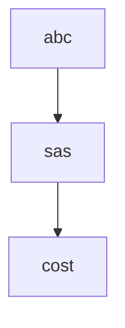
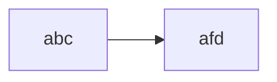

https://arxiv.org/abs/2101.08231
https://arxiv.org/abs/2212.00138
https://www.proquest.com/docview/2603407508?pq-origsite=gscholar&fromopenview=true

fep scheme to john 
drink and eat earlier to reach goals before sleep

## create t3 app

## npx create-t3-app@latest

https://papers.ssrn.com/sol3/papers.cfm?abstract_id=4354422

6 - 9 
me
pavan - c
rahul -c
tarek - c
raj - c
renato - c
~ kellon
~ eddie
~ jun
~~kevlyn~~
~~lukazs~~
~~annanda~~
~~felipe~~ 
## 11/05/2023
With a degree in Applied Mathematics and over 7 years of experience working on both AI research and Industry projects I developed a proven track record of executing end-to-end data analytics projects from understanding research topics and implementation to deploying them into small products. I developed a true passion for being innovative by experimenting new ideas that can prove to be impactful and translate complex research topics into practical implementations. I am a life-long learner excited about technology, even though my career focused mostly in Data Science and specifically in Natural Language Processing projects, I am always open-minded and motivated to learn about new domains, programming languages, paradigms and frameworks, broadening my skills apart from data science.

Data Scientist with software engineering skills

### Tell us a bit more about youself - and don't be humble!*(required)

Tell us a bit more about youself - and don't be humble!*(required)

1. email laura about tag key
2. attend a4ll telco + give thomas phd summary
	1. 
## 10/05/2023
## create simple login system for all apps -> with gmail
or email confirmation

## create a good looking list of items page
with examples separate from user specific items

## fix workbecnh bugs

## scalable apis

## boargames

## 06/05/2023

https://aclanthology.org/2020.cmcl-1.4.pdf
https://arxiv.org/abs/2305.02301
https://huggingface.co/dslim/bert-base-NER?text=My+name+is+Bernardo+and+I+live+in+Berkeley%2C+California.
https://www.solaresearch.org/events/lak/lak24/
https://link.springer.com/chapter/10.1007/978-3-030-52240-7_65
https://dl.acm.org/doi/abs/10.1145/3231848.3231871?casa_token=igOMIeX5r50AAAAA:C5yb1-OYqAV5fdxnrApVDskD0h1ijxaIZc3QosEsBbB6PA-uwlN6Z-FexEm51G3fPVpDUiQVswC5Ww
https://www.pnas.org/doi/abs/10.1073/pnas.1815156116
https://www.tandfonline.com/doi/full/10.1080/23247797.2017.1396071?casa_token=MhGK9Gq_IcEAAAAA:NajreBJhGb7SBKCn2weT209KQ-VygPpQkMwUYGQmlymQQ6k-yGLzL_98pxBnWRiAAyhq0oHXatK2ZQ
https://aclanthology.org/P16-1174.pdf
https://dl.acm.org/doi/abs/10.1145/1229428.1229469?casa_token=YF668uwD2A0AAAAA:4UPxIQXdQ4DKQXvZidRF88b_47SJwvxBE2LVtqV8GWMac3bwI32N16wKV1mRrkM5o9yXw0SFhKJuvQ
https://scholar.google.com/scholar?hl=en&as_sdt=0%2C5&q=spaced+repetition+duolingo&oq=spaced
https://huggingface.co/theainerd/Wav2Vec2-large-xlsr-hindi
no input until i progress in the outputs of the day
https://www.youtube.com/watch?v=uYwBNET_fng
## 05/05/2023

https://maxyourmarks.com/
https://www.ndrc.ie/apply
https://www.druidlearning.com/
https://www.youtube.com/watch?v=2EvF0Pc0GD4&list=PLOo3UksOudzNqtyrHe691rutJEwAbBCrL&index=7
https://www.youtube.com/watch?v=-Z-BE6uRyL4
https://lightning.ai/pages/courses/deep-learning-fundamentals/unit-8.0-natural-language-processing-and-large-language-models/

## 04/05/2023
what is my hope in being able to understand the new convenat
matthew 24:14
and this gospel of the kingdom will be preached in the whole
world as a testimony to all nations , and then the end will come

proverbs  16:9
in their hearts humans plan their coourse but the lord establishes their steps
proverbs ch2 
and if you look for it as for silver  
    and search for it as for hidden treasure,  
5 then you will understand the fear of the Lord  
    and find the knowledge of God.
    
mathew 7

### True and False Disciples

21 “Not everyone who says to me, ‘Lord, Lord,’ will enter the kingdom of heaven, but only the one who does the will(prophecy) of my Father who is in heaven. 22 Many will say to me on that day, ‘Lord, Lord, did we not prophesy in your name and in your name drive out demons and in your name perform many miracles?’ 23 Then I will tell them plainly, ‘I never knew you. Away from me, you evildoers!’

I must know prophecy and fulfilment in order to know where god is today

what is my hope in being able to understand the new covenant ( god's promise)
testify about prophecy and fulfilment 
summary
 - the bible is ahistory of war between god whosi s life and stan who is death
-  there are 8 different eras in the bible and believers mustk now the prophecy and fullfilmen
- the purpose of god recordings the contents of the bible is for us to have eternal life ( 1jn 5: 13)
-  prophecy is mostly record in paraboles

acts 2:25-31 (ps 16:10) people
rev 11:8 places (paraboles)

rosea 12: 10
Sow righteousness for yourselves,  
    reap the fruit of unfailing love,  
and break up your unplowed ground;  
    for it is time to seek the Lord,  
until he comes  
    and showers his righteousness on you.
how is prophecy recorded ?
unlike history and moral teachings, prophecy is recorded in a different in paraboles
why is jesus the truth ? 

rv 21:1-4 -> no more death
1 jn 5:13 purpose of bible eternal life
what does it mean  to be saved  -> to receive the truth

1 tim 2 : 3-4
This is good, and pleases God our Savior, 4 who wants all people to be saved and to come to a knowledge of the truth.

rom 6:23
23 For the wages of sin is death, but the gift of God is eternal life in[[a](https://www.biblegateway.com/passage/?search=rom+6%3A23&version=NIV#fen-NIV-28092a "See footnote a")] Christ Jesus our Lord.

jn 14:28-29       ---->       Rv 21:6
prphoecy so that we believe

 lk 24:44
 44 He said to them, “This is what I told you while I was still with you: Everything must be fulfilled that is written about me in the Law of Moses, the Prophets and the Psalms.”

Isa 14: 24                     jn 19: 28-30
								  lk 24:44
OT prophets ----->   jesus
Is 7:14 > > Ps 69: 21

gen 15:13-14 ( promised land to abraham -> covenant -> exodus -> moses -> joshua)

RV 22:18-19 ( we must not add or take away)
18 I warn everyone who hears the words of the prophecy of this scroll: If anyone adds anything to them, God will add to that person the plagues described in this scroll. 19 And if anyone takes words away from this scroll of prophecy, God will take away from that person any share in the tree of life and in the Holy City, which are described in this scroll.

RV 1:8 -> god is prophecy and fullfilment
				(first letter of aplhabet and last one) 
“I am the Alpha and the Omega,” says the Lord God, “who is, and who was, and who is to come, the Almighty.”

purpose of religions is god reconnect with man

adam -> noah (descendent of adam) -> abraham -> moses -> judges -> kings -> prophets -> 1st coming -> epistles -> 2nd coming

different times of biblical history
1. creation of the world
2. exodus and the law 
3. the judges
4. the kings
5. the prophets
6. the gospel of heaven
7. the espitles
8. revelation and re-creation
LK 12:56 (they know the physical time but not the spiritual time , what time are we living spiritually)
Hypocrites! You know how to interpret the appearance of the earth and the sky. How is it that you don’t know how to interpret this present time?

GENESIS -2000years> Abraham  -2000years>  1st coming -2000years> 2nd coming
(SNAKE)                                                                                                               (revelation)

RV 12:10-11 (weapon ->> word of testimony)
 Then I heard a loud voice in heaven say:

“Now have come the salvation and the power  
    and the kingdom of our God,  
    and the authority of his Messiah.  
For the accuser of our brothers and sisters,  
    who accuses them before our God day and night,  
    has been hurled down.  
11 They triumphed over him  
    by the blood of the Lamb  
    and by the word of their testimony;  
they did not love their lives so much  
    as to shrink from death.

JN ch 8 
40 As it is, you are looking for a way to kill me, a man who has told you the truth that I heard from God. Abraham did not do such things. 41 You are doing the works of your own father.”

“We are not illegitimate children,” they protested. “The only Father we have is God himself.”

42 Jesus said to them, “If God were your Father, you would love me, for I have come here from God. I have not come on my own; God sent me. 43 Why is my language not clear to you? Because you are unable to hear what I say. 44 You belong to your father, the devil, and you want to carry out your father’s desires. He was a murderer from the beginning, not holding to the truth, for there is no truth in him. When he lies, he speaks his native language, for he is a liar and the father of lies. 45 Yet because I tell the truth, you do not believe me!

2 COR 10:3-5 (God vs Satan)
For though we live in the world, we do not wage war as the world does. The weapons we fight with are not the weapons of the world. On the contrary, they have divine power to demolish strongholds. We demolish arguments and every pretension that sets itself up against the knowledge of God, and we take captive every thought to make it obedient to Christ.

revelation 12: 7-9 (war of doctrines)
Then war broke out in heaven. Michael and his angels fought against the dragon, and the dragon and his angels fought back. 8 But he was not strong enough, and they lost their place in heaven. 9 The great dragon was hurled down—that ancient serpent called the devil, or Satan, who leads the whole world astray. He was hurled to the earth, and his angels with him.

the bibly is a history of war
- old testament there was a physical war
- now it is a spiritual war

"isaiah" 55:8-9
god's thoughts and our thoughts are totally different
god's thoughts are above us

what gods says about eternal life

1 john 5:13
i write these things to you who believe in the name of the son of god so that you may know. thqt you have eternal life

what kind of  history does the bible contain
what are the different eras in the bible?
what is the purpose of god giving the bible
how is prophecy recorded

## 02/05/2023

- live presenting pitch
- self-presenting slides

is the program mostly in person or online ?
	is the program suitable for a single founder looking for co-founders ?
	logistics -> do we attend in person in all the hubs ?
	attended I2I 

ndrc pre-acc
-> customer discovery n dev
-> proudcs
-> metrics 
-> pathways to funding
-> how to craft the perfect pitch

find your first customers 
get insihgts from experts
built, scaled and exited, fellow founders on the program

active vocabulary ?

can we predict the sentences taht are most likely to trigge an error ?
can we predict the position mostl ikely to be an error ?
can we predict a corrections as well ?
can we predict what a learner might do ?

in which token is the error most likely to occur ?
try to model the probability of making an error
what's the required granularity to emulate learners errors/production

https://drive.google.com/drive/u/0/folders/1z_ZH5cZe0RKcOaHCCleY1U-tn3HHBYa8
https://docs.google.com/document/d/13rOJ4llcH9XJSRIVG-oWxzWr3JolyOIRSu2qXek7YPw/edit#
https://docs.google.com/document/d/1dm2Uv9dRr3Lc3H0UBcq5VcwAxbYOH5RT/edit
https://docs.google.com/spreadsheets/d/1Q6G-vZ3aXT9Ok9jZqxlL17LgpzDMYVufONK6SspN0H4/edit#gid=1115838130
https://drive.google.com/drive/u/1/search?q=grc
https://drive.google.com/drive/u/2/my-drive
https://www.overleaf.com/project/6423e2ed5c20d7b5be9d7a3e
https://excalidraw.com/
https://calico.org/annual-conference/
https://journal.equinoxpub.com/index.php/Calico/index
https://www.google.com/search?q=ai+in+education+journal&oq=ai+in+&aqs=chrome.1.69i57j69i59j0i67i650j0i512l2j46i512j69i60l2.2384j0j1&sourceid=chrome&ie=UTF-8
https://www.eurocall-languages.org/publications/recall-journal
https://spraakbanken.gu.se/en/research/themes/icall/nlp4call-workshop-series/nlp4call2022
https://ecp.ep.liu.se/sltc/issue/view/52
https://www.clarin.eu/event/2023/workshop-profiling-second-language-vocabulary-and-grammar
https://calendar.google.com/calendar/u/1/r?tab=mc
https://calendar.google.com/calendar/u/2/r?tab=mc
https://mail.google.com/mail/u/0/#search/from%3A+bernardo+pass/FMfcgxwKkRDqczFmcjzvqDFSJrftgFdK
https://mail.google.com/mail/u/2/#inbox
https://calendar.google.com/calendar/u/2/r/customday
https://www.google.com/search?q=ai+for+education&oq=ai+for+education&aqs=chrome.0.0i355i512j46i512j0i512l4j69i60l2.7850j0j1&sourceid=chrome&ie=UTF-8
https://journal.equinoxpub.com/CALICO
https://www.eurocall-languages.org/registration-for-eurocall-2021
https://docs.google.com/presentation/d/1J4Q1zRSYk77YJ5WhTyexWqOdV3na5jgC/edit#slide=id.g22f2a42ac94_0_190
https://web.whatsapp.com/
https://www.youtube.com/watch?v=gPBrHwGZueg
https://www.youtube.com/watch?v=sx_l6lCjX2c
https://www.youtube.com/watch?v=T9ikpoF2GH0
https://www.youtube.com/watch?v=0LNQxT9LvM0
https://www.youtube.com/watch?v=C27RVio2rOs
https://www.youtube.com/watch?v=Jzz4AEIddzY
https://www.youtube.com/watch?v=6lY9CYIY4pQ
https://www.youtube.com/watch?v=Vh3y1ela-_s
https://www.youtube.com/watch?v=0lJKucu6HJc
https://www.youtube.com/watch?v=URiIsrdplbo

https://www.youtube.com/watch?v=jnutb5Z4wyg
https://www.youtube.com/watch?v=jm0CWlb5vvQ
https://www.youtube.com/watch?v=qeir72soorI
https://www.youtube.com/watch?v=fO2T5tRu3DE
https://www.youtube.com/watch?v=ASNnN6rK65k
https://www.youtube.com/watch?v=Q_0XW46IlHY
https://www.coursera.org/learn/mlops-aws-azure-duke/lecture/KXnZq/meet-your-course-instructor-noah-gift
https://wordasimage.github.io/Word-As-Image-Page/?utm_source=substack&utm_medium=email
https://portershed.clr.events/event/134012:new-frontiers-office-hours-with-tony-okelly
file:///Users/bernardostearns/Desktop/The-Mom-Test-en.pdf
https://app.speechify.com/item/69f1d0b7-1f5a-4f30-a204-b46d9bcbfc8d?page=1
https://docs.google.com/document/d/1Gfc801bMQ1rpqwKpHaHrvACXpX-SkZkEQRkqzCxLerw/edit
https://www.newfrontiers.ie/
https://web.whatsapp.com/
https://www.linkedin.com/in/lorrainecurham/
https://calendly.com/lorrainecurham/one-to-one?month=2023-05&date=2023-05-11
https://www.f6s.com/dogpatchlabs/about
http://library.lol/main/FF27B93DB38D6F43A4EF0FE52534705B
https://www.linkedin.com/feed/
https://calendly.com/lorrainecurham/one-to-one?month=2023-05
https://www.linkedin.com/company/ndrc/about/
https://www.ndrc.ie/programmes

## meeting john

## FUTURE WORK
--> finding good learneable sentences for learner through adversarial attacks
--> Investigate the relationship among masking strategies during fine tuning and ungrammatical structure predicatbility 
--> Engineering Learner Language Models
--> Evaluate content/exercise genreation for vocabulary leaarning 
GREW
## fix my fees 
## grc form 
## form to switch to phd
## fep scheme renewal
## i2i , new frontiers

An entire MBA fits on one page.  
  
But you better know the math cold. *Updated*  
  
Like & comment if you want the new excel.  
  
6 topics:  
  
First, the update:  
  
2 new divisions to illustrate an essential point.  
  
#1 Low margin decliner at 40% of start revenue  
  
#2 High margin "viral" growth product at 10% of start revenue  
  
Start & end revenue set to be identical to the last file.  
  
But the valuation almost doubles.  
  
Why?  
  
  
6 topics:  
  
*1) Unit economics*  
  
Builds unit economics to company financials.  
  
Quantity per unit, growth.  
  
Unit price, cost; unit marketing spend.  
  
Drive return on ad spend (ROAS), customer acquisition cost (CAC), LTV/CAC, gross margins (GM).  
  
Model sets up four products:  
  
A high margin, low price power, low growth product  
  
vs. a low GM, better pricing power, better growth, lower unit market cost product  
  
vs. a high margin "viral" growth product  
  
vs. a low margin, declining product  
  
To show the dynamics of each over time.  
  
And their impact on the model and on value.  
  
  
*2) Accounting*  
  
Units flow to revenue, variable COGS, SG&A.  
  
Into EBITDA, EBIT, EBT, Net income & EPS.  
  
Simple cash flow statements & balance sheets reconcile D&A to inflation-adjusted replacement CapEx, debt, & GAAP PP&E.  
  
You need accounting fluency to look at equities.  
  
Not because accounting matters.  
  
But because it can obscure what matters.  
  
  
*3) Operating ratios*  
  
Units output financials, which drive ratios.  
  
Rev & EBITDA growth, margins.  
  
Contribution margins (= change in profit over change in revenue)  
  
Net debt-to-EBITDA, net debt % of EV  
  
  
*4) Valuation*  
  
You can drive valuation on multiples or DCF  
  
Which are equivalent:  
  
The discount rate minus growth rate = the 'terminal multiple.'  
  
Using a P/E instead of a DCF just uses next year as the terminal value.  
  
DCF here mapped to multiples.  
  
So why did this valuation double with the same start & exit revenue?  
  
Short version:  
  
Contribution from the high growth but small starting product.  
  
Leave the exit business with higher margins  
  
And higher terminal growth.  
  
But the long version in the math.  
  
  
*5) Corporate finance & DCFs*  
  
DCF here using the CAPM  
  
Beta from returns, cost of debt  
  
= WACC: the theoretically right discount rate  
  
DCFs are assumption laden - you get out whatever you want.  
  
But realistically:  
  
Your banker (or analyst) will make the math show a 7-13% discount rate.  
  
Varying with risk, industry, market - and whatever they want to achieve.  
  
  
*6) The hard part*  
  
This then sensitizes value and multiples to unit and price.  
  
Bringing unit drivers full circle to valuation outcomes.  
  
  
Ultimately, the math isn't the hard part.  
  
You need fluency in the math, its nuances and its limits.  
  
But once you are, you also have to shift focus.  
  
To the hard part.  
  
Which is filling in the numbers.  
  
If you’re investing, that means thoughtful unit drivers; how, when, and why they shift.  
  
And if you're building, it means making the numbers on the page happen.  
  
That's all for now.  
  
Like & comment if you want the updated excel.

https://ncert.nic.in/textbook.php?ahhn1=1-19
https://www.youtube.com/watch?v=cjdF66Pu9FI
https://www.youtube.com/watch?v=0xIX6mQnrwo
https://www.youtube.com/watch?v=4zHCEr8YhOI&list=PLBfupwmfhBrXawVqxjaOx_8g-y7eKZs0C
https://www.youtube.com/watch?v=ynJ25f_m2SM

## 01/05/2023
BASICS OF THE BIBLE

JoHN 14:29 x3 
an d n0w i have told before to past that you might bleieve

**I've told you this ahead of time, before it happens, so that when it does happen, the confirmation will deepen your belief in me**.

i ave told you now before it happens so that when it does happens you do believe

i have told you now before it happenbs so that when it does happen you will believe

i have told you now before it happenbs so when it happensyou will believe

how can we show god our hearts ?
what is one action step you will tkaea this week to show 

psalm 25:14

the lord confides in those who fear him he makes his covenant known to them

acts 8:32

jews didn't keep covenant 

jesus was refered to be the lamb
isaish 53:7 let the lambd appear and let the lamdb be slaughtered and our sins 

the bible is a book of covenants that god made with us to give us eternal life when we keep the covenants

the bible is the writing of god and conitanis gods will, plans and purpose for us and hwo to help him reconnect and lvie with hipm eternally

the bible is made up of four types of contents that believer must understand to attain hraven and etnernal life.
	1. history
	2. instruction
	3. prophepcy 
	4. fullfilment
special mission
	-> write out john 14:29 and send to review teacher
		i tell you now before it happens so that you believe 
teh four contetns of the bible n purposes
	1- history -> warning & example (1 cor 10:11)
	2- instructon -> to be equipped as a person of god ( 2 tim 3:16-17) righteous in gods eyes
	3- prophecy: to believe in the ___ ( jn 14:29)
	4- fullfilment 
		old testament

the 12 disciplies listened to jesus 
we must be trusthworthy

1 Cor 2: 7-10:
	no we cdeclare gods wisdom that have been hiden none of these ruler have nuderstood if they had they wouldnt have sacrificed 
	for those who love him
	god is revelead by the spirit
god's teaching Gal 1:11-12
revelation  - apostol john received one revelation (the book revelation)
i want you to know b and s that the gospel i preach is not by human oirigin but from jesus christ
spriti reveals gods secrets

prophecy sealed scroll -> own interpretations

god's thoughts higher than our thoughts

2 pet 1:21 
prophets were carried along through the holy spirit
prophets spoke from god 
god through different people 
god is spirit -> it created the same way we write something with a pen
we are the creator but the pen writes it
god is the author of the bible (not in a literal sense)

book of convenants
	promise of god
	RV 1:3 keep the word of prophecy : blessing 
	Lk 18:8 the snd coming of jesus will he find faith
	keeps -> salvation and heaven; not keep -> hell
	####
	Revelation: Rv 1:5~6 5:9~10 713~14 12:11
	jesus blood, jR 22:20 jesus coming soon
	LK 22 : 14 ~ 20
	made with blood of jesus - 
	jn 1: 11 ~ 13
	believe jesus -> god's chidlren (Rom 2:28-29)
	something wrong with the first covenant (heb 8: 7~13)
	acts 13: 26~27
	did not recognizze jesus and words of the prophet
	
	subject: god and physical israelites
	law of moses + promise of messiah 
	result : god - sent messiah ( jesus)
	chosen people - did not accept him

two main covenants in the bible
	-> the two testaments 
		old testament: Genesis - Malachi
		39 books
		929 chapters
		new testament: Matthew - Revelation
		27 books
		260 chapters
	main ref: 1 John 5:13

	the bible is a book of covenants 
	the bible is the writing of god, live with him eternally.  god's will plan and purpose
	the bible is made up of four contents 

https://www.youtube.com/watch?v=k8PEPFrEBWY
https://www.youtube.com/watch?v=q27amQXGChc
https://www.youtube.com/watch?v=kCc8FmEb1nY
## 30/04/2023
https://www.tutorialspoint.com/sqlite/sqlite_create_table.htm
https://drogon.org/
https://drogonframework.github.io/drogon-docs/#/ENG-08-2-Database-Transaction
https://github.com/BIGBALLON/PyTorch-CPP
https://www.tutorialspoint.com/sqlite/sqlite_c_cpp.htm
https://stackoverflow.com/questions/9389344/error-undefined-reference-to-sqlite3-open
https://libgen.is/search.php?&req=c%2B%2B+programming&phrase=1&view=simple&column=def&sort=year&sortmode=DESC&page=15
https://libgen.is/book/index.php?md5=F168A0766C076BEF7135CAFF866E3830
https://libgen.is/book/index.php?md5=037B5FB5350AF974D25E00BD2B2B6B5F
https://libgen.is/book/index.php?md5=BBAFF37BCE544830CE49DFF9E08D5E59
https://libgen.is/book/index.php?md5=6AFD24CAA2DF5197B87439B2FEB3FDB5
https://libgen.is/book/index.php?md5=6312487C8CE3FB913104D4340B9E93E8
https://libgen.is/book/index.php?md5=06625EC2F48D70D02CE9DF62047C1533
https://libgen.is/book/index.php?md5=E7B9A7DFE131DE614A9037CB0FC99CFB
https://libgen.is/book/index.php?md5=80D1FF9766DFEF8A56BEBD3F1D4E4106
https://libgen.is/book/index.php?md5=187497CC7AD12A292FBDA7791B2E3E66
https://libgen.is/search.php?req=Thomas+Mailund+%5BThomas+Mailund%5D&column=author
https://libgen.is/book/index.php?md5=BD909A4E16B4A14B8494BAC0D7EBBB20
https://libgen.is/book/index.php?md5=D68F6199646CA63591A6D8419E0ED4BA
https://libgen.is/book/index.php?md5=7F9692CCBDC64225FAE08EB0CE84BEE5
https://libgen.is/book/index.php?md5=D5BFC25CB3A252F220AD2F29401FE5A0
http://library.lol/main/9FE9FAF9A6454C0C303042A49E9FA1BA
https://libgen.is/book/index.php?md5=E893000F4F9A5628460C55932690A4A0
chrome://downloads/
file:///Users/bernardostearns/Desktop/lowlevel_George%20S.%20Tselikis%20-%20Introduction%20to%20C++%20_%20%20500+%20Difficulty-Scaled%20Solved%20Programming%20Exercises.-CRC%20Press%20(2023).pdf
https://drogonframework.github.io/drogon-docs/#/ENG-07-Session
https://drogonframework.github.io/drogon-docs/#/ENG-04-2-Controller-HttpController
https://drogonframework.github.io/drogon-docs/#/ENG-10-Configuration-File
https://www.docker.com/blog/multi-arch-images/
https://chat.openai.com/
https://portershed.clr.events/event/134012:new-frontiers-office-hours-with-tony-okelly
https://docs.google.com/spreadsheets/d/1x1qgjkJU8IlhoCMi_FtFN7A5PZzBsjGj5vd9PB5bRME/edit#gid=0
https://blocked.freedom.to/
https://stackoverflow.com/questions/7542381/vim-how-to-specify-arrow-keys
https://bobbyhadz.com/blog/react-router-go-back-to-previous-page
https://github.com/jpedroschmitz/typescript-nextjs-starter
file:///Users/bernardostearns/Desktop/2806_137_6OKF.mp4
https://reactrouter.com/en/main/components/navigate
http://localhost:3000/tokeniser/Conaille_Muirtheimne.txt
https://ncoughlin.com/posts/react-router-variable-route-parameters/
https://stackoverflow.com/questions/45399951/how-to-perform-string-interpolation-in-typescript
https://inciteful.xyz/p/W2510483507
https://scholar.google.com/scholar?start=10&q=learner+language+model&hl=en&as_sdt=0,5
https://www.sciencedirect.com/science/article/pii/S1041608023000195
https://arxiv.org/abs/1909.08593
https://blocked.freedom.to/
https://inciteful.xyz/p/W3152540792
https://blocked.freedom.to/
chrome://downloads/
https://medium.com/@Dickson_Mwendia/top-6-tools-for-api-load-testing-7ff51d1ac1e8
https://www.artillery.io/
https://levelup.gitconnected.com/system-design-interview-survival-guide-2023-preparation-strategies-and-practical-tips-ba9314e6b9e3
https://medium.com/@shyamsundarb/c-vs-rust-vs-go-a-performance-benchmarking-in-kubernetes-c303b67b84b5
https://www.techempower.com/benchmarks/#section=data-r21
https://github.com/codesenberg/bombardier
https://github.com/drogonframework/drogon
https://drogon.org/
https://hub.docker.com/r/drogonframework/drogon
https://hub.docker.com/_/ubuntu
https://www.warp.dev/terminus/dockerfile-run-sh
https://github.com/microsoft/vcpkg/issues/12760
https://askubuntu.com/questions/1317855/cmake-error-configuring-incomplete-errors-occurred
https://stackoverflow.com/questions/49881782/running-the-coroutines-example-under-ubuntu-16-04-gives-experimental-coroutine
chrome://newtab/
https://www.howtoinstall.me/ubuntu/18-04/libc++1/
https://github.com/conda/conda/issues/9741
https://trendoceans.com/install-boost-library-for-c/
https://github.com/drogonframework/drogon/issues/760
https://stackoverflow.com/questions/34549859/run-a-script-in-dockerfile
https://github.com/drogonframework/drogon
https://www.reddit.com/r/cpp/comments/x5g24t/what_would_you_prefer_a_c_backend_drogon_or_aws/
https://aws.amazon.com/blogs/compute/introducing-the-c-lambda-runtime/
https://stackoverflow.com/questions/17549906/c-json-serialization
https://chat.openai.com/
https://jsoncpp.sourceforge.net/class_json_1_1_value.html
https://mail.google.com/mail/u/0/#inbox/FMfcgzGsmNVlMvdbdBCTFvHwccqxDvjv
https://magazine.sebastianraschka.com/p/finetuning-large-language-models?utm_source=substack&utm_medium=email
https://docs.google.com/spreadsheets/d/1x1qgjkJU8IlhoCMi_FtFN7A5PZzBsjGj5vd9PB5bRME/edit#gid=0
https://script.google.com/home/projects/14qX6R3QbYBzNBedu5CH5yrtuCyx_tScWDb4wJ0cVzMdH90fNMT9QLdeH/edit
https://www3.animeflv.net/ver/black-clover-tv-147
https://www.sqlite.org/quickstart.html
https://www.tutorialspoint.com/sqlite/sqlite_create_database.htm
https://www.tutorialspoint.com/sqlite/sqlite_create_table.htm
https://www.tutorialspoint.com/sqlite/sqlite_insert_query.htm
https://www.sqlite.org/autoinc.html

previous lessons 

the hope for the fullfilment -> 

is this person teaching me the will of god ni the bible

which spirit is working through each flesch

1 cor 15: 3-4
why some ppl reject jesus and few follow
	-> because of the prophecies, they believe in the prophecy

why jesus is the messiah
layreing the perception from the physical to the spiritual realm.
war between the two kind of spirits

the two kind of spirits
i shouldnt trust any kind of spirits comming from peoples words
flesh counts for nothing, but. the words from jesus  JN 6:63

luke chapter 22 verse 20
 In the same way, after the supper he took the cup, saying, “This cup is the new covenant in my blood, which is poured out for you.

-> religion : no matter how well we plan our life, to life to make sense/have meaning we need to see the bigger picture from beginning to end of biblbe
	- genysis : how disconnection happen
	- mid : testitomy of disconnect to god
	- new testment - new covenet : 
-> life is not about hte physical realm
-> Reason purpose of faith : eternal life 

	how can we love god at this time ?

what is my hope in being  reconnected with god ?
inner peace, inner fights
get a broader perspective about life
	-> find my clear path and purpose 
	-> get a broader perspective about life / expand my perspective on life

i used to persecute christians but recorded most of the new testament
	-> paul
i had royal upbringing murdered a man and fled my home -> moses

	I was the first person to see jesus after he ressurected
	-> 
moses led ppl out of egypt

i led. the israelites as they entered t he promised land  -> moses

god showed a rainbow to noah

OUTPUTING TODAY
---> learning paths , MODERN UI ,  scale python backend, NLP, software architecture
if releaving hte stress is my reward what is a replacement action ?
 DEEP BREATH
 GO FOR WALK
first mistake of the day inputing music instead of focusing on output 
-> trigger , action, reward
	-> my reward is realving the stress 

achieve engineering milestones ?
	- answer via stress testing 
		- How many users concurrently can I handle for X pipeline of my app
		- MILESTONE
			- CAN MY APP HOLD LOGIN WORKFLOW FOR
				- 1 user
				- 10 users
				- 100 users
				- 1000 users
			- Can my APP HOLD RETRIEVING LIST OF ITEMS WORKFLOW FOR
				- 1 user
				- 10 users
				- 100 users
				- 1000 users
so you have to embrace the actin mode and just believe it. but keep a minority of effort on how to think differently 
if i think rationaly about "competition" pretty much anything will have a competition better than you already
I was again in dating + social media, mood was down and i was feeling confused
i finished talking at 4pm. so the cruciail waste of time wasa from 4 to 7
sent calendly, listened to the mom test, didnt do programming 
tesco then insight, insight i was mindless until gurav came to talk then spent time talking
then gym 12:20-1:20~30
not toooo bad, but spent golden hours
i woke up late, so 10:30 - 12 i was o phone - dating apps, social media and preparing smoothie
so how did i waste my time ? 
I just didn't feel like doing anything, I ended up wasting my time
that's fine, but what happened yesterday, I was being impulsive or actionless ?
which often is being detrimental
from thought to action, being impulsive means the time in between my thoughts and actions is very low
control your impulses
trim beard
cut hair
buy pedal
output ideas from your mind

## 27/04/2023

1 COR 9:24-26

john 14:29
I have told you now before it happens, so that when it does happen you will believe.

they didnt believe he looked the messiah 

the basics of the bible
1 corintinhas 9:24-26
### The Need for Self-Discipline

24 Do you not know that in a race all the runners run, but only one gets the prize? Run in such a way as to get the prize. 25 Everyone who competes in the games goes into strict training. They do it to get a crown that will not last, but we do it to get a crown that will last forever. 26 Therefore I do not run like someone running aimlessly; I do not fight like a boxer beating the air.

1 cor 15:3-4

isaihs 14:24 
god's plan still

god's will is recorded in the scripitures 
prophecy and fulfillment
isa 7:14    birth (MT 1:18-23)
misc 5:2 location (lk 2:1-7)
zec 9:9 donkey (mt 21:1-5)
mt 8:16-17 miracles (were prophesied)

what was the reason i believe in jesus until now ?
what did god do to guide believers to jesus despoite all the negative rumors ?

you study the scriputres diligentlny becasue you thjkn that in them you hae eternal life. these area the very scriputes that testify about me 

we have found this man to be a atorublemajer  stirring aup riots anong the jewds allover the world he isa ringlearder of nazaerene d=sect

the jews answered him arent we rightinsaynig that ayou are samarinta anda  demon posseseed 

then jeuss entered a house and againa a crwod gahtered so that he and hsi disciples were note even able to eat.
 when his family heard about this they went to take charge of him for they ssaid he is out of his mind 

you who are the hope of israel its savior in timeis iof distress why are you like a strand in the land like traveler who stays only a night
 why are you like a man taken by surprise  like a warrior powerless to save
 you are among us lord and awe bear your name do not forsake us

he grew up before him like a tener shoot, and like a root out of dry groumd.
he ad not beauty or majestyto attract us to  him bothng in his apprearince that we should desire him
he was despised and rejected by mankind 
a man of suffering and familair wiht pain
like one from whom peolple hide their faces he was despised and we held him in low esteem

just as sthere were many who were appalled at him his appearance was so disfigured beyond that  if any huuman being an dhis form maaried beyond human likeness

mighty

she will give birth to a son, and you are to give him the name jesus becauses he will save his peole fron their sins, (savour messiah, christ)

why is jesus the messiah 

the reason and purpose of faith -> heaven and eternal life
fix attention, what is faith god is leading to
different ways ppl conncet to the spiritual world
	-> which religion god uses to express himself ?
	-> disconnectoin - reconnection
	two kinds of spirit 
		1. 
		2.
	test the spirits

https://onlinelibrary.wiley.com/doi/full/10.1111/lang.12215?casa_token=WuvnXwillPwAAAAA%3AGSpMNy_4UqxU8us8LjdrzW7Gm5zcSxMzNR5WZC6zVfCOUj-ZmgSbydaKBUqNJclUiok_hsmoAqe0gtCp

https://www.jbe-platform.com/content/journals/10.1075/ijlcr.20009.sha

https://stackoverflow.com/questions/9095923/using-flask-login-with-postgresql

https://www.permify.co/post/jwt-authentication-in-react

https://scholar.google.com/scholar?cites=5461158132325828500&as_sdt=2005&sciodt=0,5&hl=en

https://onlinelibrary.wiley.com/doi/full/10.1111/lang.12215?casa_token=WuvnXwillPwAAAAA%3AGSpMNy_4UqxU8us8LjdrzW7Gm5zcSxMzNR5WZC6zVfCOUj-ZmgSbydaKBUqNJclUiok_hsmoAqe0gtCp
## 26/04/2023

just make sure all code you created in that burst of work is around 
so you want oprocess EFCAMDAT to csv -> you already have that .

put the hackathon code on github will show your organization of a small project

deploying the makeurbook will show your deploy skills

implementing your LM MLM experiment will be a good demonstrator of understarding that you can implement nlp pipelines

it's all in front of me, just do it

## 25/04/2023

https://github.com/lucidrains/x-transformers/blob/main/x_transformers/x_transformers.py
https://pytorch.org/tutorials/beginner/transformer_tutorial.html
https://towardsdatascience.com/masked-language-modelling-with-bert-7d49793e5d2c
https://www.kaggle.com/code/mojammel/masked-language-model-with-pytorch-transformer
https://github.com/lucidrains/mlm-pytorch
https://stackoverflow.com/questions/52468956/how-do-i-visualize-a-net-in-pytorch
https://pytorch.org/tutorials/beginner/introyt/trainingyt.html

https://www.youtube.com/watch?v=lwD8G1P52Sk
https://www.linode.com/docs/guides/write-a-neovim-plugin-with-lua/
https://www.linode.com/docs/guides/how-to-install-neovim-and-plugins-with-vim-plug/

https://www.youtube.com/watch?v=hyYCn_kAngI
https://www.youtube.com/results?search_query=how+to+discover+your+customers
https://www.youtube.com/watch?v=t0meZUDSJv4
https://www.youtube.com/watch?v=LeIePgFDAQI
https://www.youtube.com/watch?v=1eZpasYkrSE
http://paulgraham.com/ds.html
https://arxiv.org/pdf/2304.12210.pdf
https://arxiv.org/pdf/2303.18223.pdf
https://huggingface.co/deep-learning-analytics/GrammarCorrector?text=He+are+moving+here.
https://huggingface.co/vennify/t5-base-grammar-correction?text=He+are+moving+here.
https://huggingface.co/vennify/t5-base-grammar-correction
https://unix.stackexchange.com/questions/98435/using-awk-to-split-a-line-on-single-spaces-not-multiples
https://github.com/roboflow/notebooks
master masked language modelling

## 24/04/2023
## -- religion class

what worries do you ahve about your journey studying god's promise ?
1 peter chapter 5 verse 8

matthew 16:20-23

then he ordered his disciples not to tell anyone that he was hte messiah. from that time on jesus began to expalin to his disciples hat he mus go to jerusalem and suffer many things at the hands of the elders, the chieft priests and the teachers of the law and that he must be killed and on the third day be raised to life. peter took him aside and began to rebuke him. never, lord he said. this shall never happen to you. jesus turned and said to peter get behind me satan. you are stumbling block tome you do not have in mind the concerns of god but merely human concerns

the two kind of 

the three places where staan works the most in are
?(myself, my desires/sin) , ?(enviroment) and ?(spiritual teachings)

therefore to become strong believers god says not ?(trust) but to ?(test)
#########
spiritual teachings

through myself
through my enviroment
through confusions in the world of spiritual teachings

1 john 4:1
dear friends do not believe every spirit
but test every sp weather if they are from god
because many false spirit have 

2 timothy 4:3
for the time will comce when people wo;; not put up with sound doctrine instead to suit hte own desires they will gather around them a great number of teachers to say what their itching ears want to hear

in fact everyone who wasnt to live godly life in christ jesus will be persecuted

there is always a teaching that satisfies your desires

john 3:31-34

the one who comes from above isa bove all
the one who is from the earth belongs to the earth and s[eals as one from the earth
the one who comes from heaven is above all.]

satan presents himself as god

2 thessalonias 2:4 
he will oppose and will exalt himself over everything that is caleld god or worshiped so that he sets himself up in gods temple proclaiminig himself to be god

he will attack the word
john 8:44
you belong to your father the devil and you want to carry out your fathers desires
he was a murderer from the begining not holding to the trith for there is no truth in him
when he lies he speaks his native language, for he is a liar and the father of lies

luke 8:14

the seed that fell among throns stands for those who hear but as they go on their way they are choked by lifes worries, riches snda pleasures and theuy do not mature

3 ways satan works

eph 6:12
for our struggle is not agsint flesh and blood but agsinst the rulers agianst the authorities against the wpower if this dark world and against the spiritual focres of evil in the heavenly realms

where does the war is taking places?
realm of flesh vs realm of spirit

1 cor 3:16
dont u know htat yu urselves ar egod temple and that gods spirit dwells in your midst
 1 cor 3:9
for we are coworkers in gods service you are gods field god building

ezekiel 28:12-17

Isaiah 14:12-15

how you have fallen from heaven, morning start, son of the dawn
you have been cast down to the earth you who once laid low the nations
you said in your heart, i will ascend to the heavens;
i will raisem my throene 
above the stars of god
i will sit enthroned on the mount of assembly 
on the utmost heights of mount zaphon
i will ascend above the tops of the lcouds;
i will make myselfl kike th emost high
but you are brought down to the realm of the dead to the depths of hte pit

revelation 12:7-9
then war broke out in heaven 
michael and his angels fought against the dragon
and the dragon and his angels fought back.
but he was not strong enough and they lost their place i;n heave.
 the great dragon was hurled down that acnient serpetn called the devil or satan who leads the whole world astray. he was hurled to the earthm and his angels with him

psalm 103:20-21

praise the lord you his angels
you mighty ones who do his bidding 
who obey his word
 praise the lord all his heanvly hosts 
 you his servants who do his will

hebrrews 1:14
	are not all angels ministering spirits sent to server athose who woll inherit salvtion

john 4:24
god is spirit and his worshiper must worship in the spirit and in truth

exodus 3:14

god said to mses i am who iam this is what you are to sya to the israelites I am sent has me to you

john 1:1-4

in the beginning was the words, and the word was with god and the word was god.
he was with god in the beginning. through him all things were made; without him nothing was made that has been made. in him was life, and that life was the light of all mankind

to undersatnd spirit we need to udnerstand god which is a spirit itself

in the end -> revalation, understand god's plan for reconection
in the mmiddle -> the solution , attoning for sin
at the beginig of the bible genesys -> disconnection
G -> B (OT , NT) covenets, promise and a will for us to undersatnd

god's disconnection is the reason of divisoin confuison pain suffering ?
therefore god''s reconnection is the only promsed way to live a good life 

the two kind of spirits

- god and the holy spirit
- 

https://grew.fr/tutorial/02_first_rule/
https://www.cosmicpython.com/book/chapter_04_service_layer.html
https://www.cosmicpython.com/#buy_the_book
https://www.cosmicpython.com/blog/2019-08-03-ioc-techniques.html
https://www.cosmicpython.com/blog/2020-05-12-ddia-review.html
https://www.cosmicpython.com/blog/2020-10-27-i-hate-enums.html
https://www.cosmicpython.com/blog/2017-09-19-why-use-domain-events.html
https://calendly.com/gcid-rosemary/meeting-with-rosemary/2023-04-25T13:00:00+01:00?back=1&month=2023-04&date=2023-04-25
https://docs.google.com/document/d/1Gfc801bMQ1rpqwKpHaHrvACXpX-SkZkEQRkqzCxLerw/edit
https://chat.openai.com/?model=text-davinci-002-render-sha
https://www.forbes.com/sites/abdoriani/2019/10/08/13-important-customer-interview-questions-to-ask-before-building-an-app/?sh=11ae563e4c15
https://e2eml.school/transformers.html#resources
https://calendly.com/gcid-rosemary/meeting-with-rosemary?back=1&month=2023-04&date=2023-04-25
https://mail.google.com/mail/u/0/#inbox
https://mail.google.com/mail/u/2/#inbox
https://mail.google.com/mail/u/0/#inbox
https://drive.google.com/drive/u/0/my-drive
https://medium.com/@_megangroves/how-to-reach-out-to-press-guide-for-startups-d64f5bf3471a
https://www.inc.com/
https://techcrunch.com/
https://techcrunch.com/2023/04/23/last-impressions-matter/
https://techcrunch.com/2023/04/22/netflix-history-25-years/
https://arxiv.org/pdf/2303.14957.pdf
https://mail.google.com/mail/u/0/#inbox
https://github.com/IllDepence/unarXive
https://github.com/berstearns/makeurbook2/issues/26
https://www.youtube.com/
https://www3.animeflv.net/ver/black-clover-tv-104
https://mail.google.com/mail/u/0/#inbox
https://www.youtube.com/watch?v=XA2WjJbmmoM
https://www.youtube.com/watch?v=wlR5gYd6um0
https://gateway.ipfs.io/ipfs/bafykbzaceapjezux7u7ufwlms4kxhr6fkr5d46gx7jrbxlw5i5klo3r7mkiji?filename=Arnold%20Robbins%2C%20Elbert%20Hannah%20-%20Learning%20the%20vi%20and%20Vim%20Editors_%20Power%20and%20Agility%20Beyond%20Just%20Text%20Editing-O%27Reilly%20Media%20%282021%29.pdf
https://www.lazyvim.org/configuration/examples
https://github.com/LazyVim/starter
https://calendar.google.com/calendar/u/1/r?tab=mc
https://nuigalway-ie.zoom.us/j/93450633817?pwd=SWppQkdLM0h6dUozRHMzMkd3WkQ0dz09#success
https://github.com/ryanoasis/vim-devicons/wiki/Installation
https://github.com/ryanoasis/nerd-fonts#font-installation
https://www.nerdfonts.com/font-downloads
https://www.nerdfonts.com/cheat-sheet
https://github.com/ryanoasis/vim-devicons
https://www.nerdfonts.com/#features
https://github.com/ryanoasis/vim-devicons
https://arxiv.org/abs/2206.00606
https://magazine.sebastianraschka.com/p/finetuning-large-language-models
https://app.slack.com/client/T0A26858X/D01A05QUB1S/thread/D01A05QUB1S-1682339105.066849
https://docs.google.com/spreadsheets/d/1x1qgjkJU8IlhoCMi_FtFN7A5PZzBsjGj5vd9PB5bRME/edit#gid=0
https://cadhan.com/index-en.html
https://grew.fr/grew_match/help/
https://cadhan.com/gramadoir/foirm-en.html
https://github.com/kscanne/gramadoir
https://github.com/kscanne/caighdean

## 23/04/
https://layout-parser.readthedocs.io/en/latest/example/deep_layout_parsing/index.html
https://layout-parser.github.io/
https://packages.debian.org/buster/tesseract-ocr
https://docs.docker.com/config/pruning/
https://github.com/Layout-Parser/layout-parser/issues/168
https://www.google.com/search?q=restric+docker+image&oq=restric+docker+image&aqs=chrome..69i57j0i22i30l4j0i15i22i30j0i390i650l3.2133j1j1&sourceid=chrome&ie=UTF-8
https://www.geeksforgeeks.org/python-how-to-put-limits-on-memory-and-cpu-usage/
https://likegeeks.com/python-profiling/
https://stackoverflow.com/questions/19098104/python-opencv2-cv2-wrapper-to-get-image-size
https://phoenixnap.com/kb/docker-memory-and-cpu-limit
https://stackoverflow.com/questions/42345235/how-to-specify-memory-cpu-limit-in-docker-compose-version-3
https://docs.docker.com/compose/compose-file/compose-file-v3/
https://github.com/berstearns/DiT
https://stackoverflow.com/questions/25186591/having-cv2-imread-reading-images-from-file-objects-or-memory-stream-like-data-h
https://docs.opencv.org/2.4/modules/highgui/doc/reading_and_writing_images_and_video.html?highlight=imdecode#cv2.imdecode
https://stackoverflow.com/questions/14134892/convert-image-from-pil-to-opencv-format
https://mail.google.com/mail/u/2/#inbox/FMfcgzGsmDxCVCDSScTgMbsxkWRfcpFC
https://magazine.sebastianraschka.com/p/finetuning-large-language-models
https://layout-parser.readthedocs.io/_/downloads/en/stable/pdf/
http://localhost:3000/read
https://layout-parser.readthedocs.io/_/downloads/en/stable/pdf/
https://layout-parser.readthedocs.io/en/latest/notes/modelzoo.html
https://github.com/Layout-Parser/layout-parser/issues/created_by/lolipopshock
https://github.com/Layout-Parser/layout-parser
https://github.com/edisongustavo
https://edisongustavo.github.io/
https://edisongustavo.github.io/posts/fizzbuzz/
https://github.com/Layout-Parser/layout-parser/blob/main/.github/CONTRIBUTING.md
https://github.com/open-mmlab/mmocr
https://layout-parser.readthedocs.io/en/latest/api_doc/models.html
https://layout-parser.readthedocs.io/en/latest/example/deep_layout_parsing/index.html
https://calendly.com/gcid-rosemary/meeting-with-rosemary?back=1&month=2023-04&date=2023-04-24
https://calendar.google.com/calendar/u/1/r
https://superuser.com/questions/276321/how-to-export-opened-tabs-in-chrome
file:///Users/bernardostearns/Downloads/my_work_diagrams.pdf

https://docs.google.com/presentation/d/1J4Q1zRSYk77YJ5WhTyexWqOdV3na5jgC/edit#slide=id.p1
https://spraakbanken.gu.se/l2p-2023
https://mail.google.com/mail/u/1/#inbox
https://spraakbanken.gu.se/larkalabb/cefrtools/
https://spraakbanken.gu.se/larkalabb/svlp
https://spraakbanken.gu.se/l2p-2023
https://scholar.google.com/citations?hl=en&user=LL_Y7TYAAAAJ&view_op=list_works&sortby=pubdate
https://www.zora.uzh.ch/id/eprint/200087/
https://dial.uclouvain.be/pr/boreal/object/boreal:204347
https://hal.science/hal-01861652/document
https://arxiv.org/abs/2206.08724
https://scholar.google.com/citations?view_op=view_citation&hl=en&user=LL_Y7TYAAAAJ&sortby=pubdate&citation_for_view=LL_Y7TYAAAAJ:mB3voiENLucC
https://scholar.google.com/citations?view_op=view_citation&hl=en&user=LL_Y7TYAAAAJ&sortby=pubdate&citation_for_view=LL_Y7TYAAAAJ:e5wmG9Sq2KIC
https://scholar.google.com/citations?view_op=view_citation&hl=en&user=LL_Y7TYAAAAJ&sortby=pubdate&citation_for_view=LL_Y7TYAAAAJ:TQgYirikUcIC
https://scholar.google.com/citations?view_op=view_citation&hl=en&user=LL_Y7TYAAAAJ&sortby=pubdate&citation_for_view=LL_Y7TYAAAAJ:5nxA0vEk-isC
https://scholar.google.com/citations?view_op=view_citation&hl=en&user=LL_Y7TYAAAAJ&sortby=pubdate&citation_for_view=LL_Y7TYAAAAJ:RHpTSmoSYBkC
https://scholar.google.com/citations?view_op=view_citation&hl=en&user=LL_Y7TYAAAAJ&sortby=pubdate&citation_for_view=LL_Y7TYAAAAJ:hC7cP41nSMkC
https://scholar.google.com/citations?view_op=view_citation&hl=en&user=LL_Y7TYAAAAJ&sortby=pubdate&citation_for_view=LL_Y7TYAAAAJ:M3ejUd6NZC8C
https://scholar.google.com/scholar?hl=en&as_sdt=0%2C5&q=gerldine+mark&btnG=
https://www.jbe-platform.com/content/journals/10.1075/ijcl.14086.oke
https://scholar.google.com/citations?user=KoHKkCwAAAAJ&hl=en&oi=sra
https://mail.google.com/mail/u/0/#inbox
https://mail.google.com/mail/u/1/#inbox
https://mail.google.com/mail/u/2/#inbox/FMfcgzGsmDtjfPfqGbPdsPmQHMDnMdvd
https://www.linkedin.com/jobs/view/3556239889/?refId=inLj7JLzXRlf7WXvub21Jw%3D%3D&trk=eml-sjr-top-apply-cta&midToken=AQFaULGDTE-fnA&midSig=03Or3-agoZMGI1&trkEmail=eml-email_jobs_saved_job_reminder_01-null-13-mercado_redesign-null-694r0v%7Elgpgto4y%7Ehk-null-jobs%7Eview
https://www.linkedin.com/jobs/view/3552238328/?refId=inLj7JLzXRlf7WXvub21Jw%3D%3D&trk=eml-sjr-top-apply-cta&midToken=AQFaULGDTE-fnA&midSig=03Or3-agoZMGI1&trkEmail=eml-email_jobs_saved_job_reminder_01-null-11-mercado_redesign-null-694r0v%7Elgpgto4y%7Ehk-null-jobs%7Eview
https://www.linkedin.com/notifications/?filter=all
https://spraakbanken.gu.se/l2p-2023
https://www.gu.se/om-universitetet/hitta-person/elenavolodina
https://scholar.google.com/citations?user=YcpEL2YAAAAJ&hl=sv
https://www.gu.se/om-universitetet/hitta-person/davidalfter
https://stackoverflow.com/questions/67035685/detectron2-speed-up-inference-instance-segmentation
https://or.stackexchange.com/questions/10360/linear-programming-except-each-thing-you-can-spend-time-on-has-its-own-feasib
https://en.wikipedia.org/wiki/Stigler_diet
https://neos-guide.org/case-studies/om/the-diet-problem/#:%7E:text=The%20problem%20is%20formulated%20as,and%20cholesterol%20in%20the%20diet.
https://scholar.google.com/scholar?hl=en&as_sdt=0%2C5&q=elena+volodina&btnG=
https://link.springer.com/article/10.1007/s10579-013-9251-2
https://developers.google.com/optimization/lp/stigler_diet
https://scholar.google.com/scholar?hl=en&as_sdt=0%2C5&q=vocabulary+lists+for+irish&btnG=
https://journals.sagepub.com/doi/pdf/10.1177/1367006919848142?casa_token=5LY--APDyzEAAAAA:wh3TFTRFCBnHjp6bU3ebgW5xiGZZGcQymo-_XLZNKZOIPE2XkExvIRwwfHQ06_2xSXAxq9YK1FLAJQ
https://muse.jhu.edu/article/451296
http://localhost:3000/read
https://edtechimpact.com/categories/parent-engagement
https://edtechimpact.com/
https://edtechimpact.com/products/learning-ladders
https://www.konaequity.com/company/learning-ladders-4860284285/
https://mail.google.com/mail/u/1/#inbox
https://mail.google.com/mail/u/0/#inbox
https://mail.google.com/mail/u/2/#inbox
https://www.youtube.com/watch?v=f7TnuO02DjM
https://www.youtube.com/results?search_query=CLEAN+ARCHITECTURE+%26+DDD+From+Scratch+Tutorial+%7C+Part+11
https://www.youtube.com/watch?v=fhM0V2N1GpY&list=PLzYkqgWkHPKBcDIP5gzLfASkQyTdy0t4k
https://www.youtube.com/watch?v=tLk4pZZtiDY&list=PLYpjLpq5ZDGstQ5afRz-34o_0dexr1RGa
https://www.youtube.com/watch?v=5_un3PUER8U
https://www.youtube.com/watch?v=fhM0V2N1GpY
https://www.youtube.com/feed/library
https://www.youtube.com/watch?v=v9ejT8FO-7I&list=PLrhzvIcii6GNjpARdnO4ueTUAVR9eMBpc
https://docs.google.com/spreadsheets/d/1x1qgjkJU8IlhoCMi_FtFN7A5PZzBsjGj5vd9PB5bRME/edit#gid=0
https://www3.animeflv.net/ver/black-clover-tv-100
https://superuser.com/questions/276321/how-to-export-opened-tabs-in-chrome

how will knowing god's plan impact my life ?

next time
the three places where satran works the most in are ? , ? and ?

therefore to vecome strong believers god says not to ? but to do ?

# What is true religion ?

in the beginning was the word and the word was with god and the word was god

in the beginning was the word and the word was with god and hte word was god

in the beginning was the word and the word was with god and the word was god

in the begining was the word and the word was with god and the word was god

in the beginning was the word and the word was with god and the word was god

god's disconnect is the reason of divsion, confusion pain suffering ?
therefore god's reconnection is the only promised way to lvie a good life.

eclesiaastes 7:8

the end of a matter is better than it begin and patience is btetter than pride

revelation 21:3-4

and i heard a loud voice fro teh throne saying look gods dwelling place is now maong the people and he will dwell with them. they will be his people and god himself will be with them and be their god. he will wipe every tear form their eyes hteree will be no more daeth or mourning or crying or pain for the old order of things has passed away. 

true religion :
	1- disconnect(sin)
	2- solution
	2 timothy 4:3-4
		for the time will come when people woll not put up wth sound doctrine instead to suit their own desires they will gather around them a great number of teacher  to say what their itching earts want to hear they will turn their ears away from the truth and turn aside to myths
		teaching that fits your own desires
	3- ** PLAN ** god's will

what is freedom ?
john 8:32
then y will kbiw the truth and the truth will sset you free

romans 8:20-21
for the cfreaton was subjected to frustatio not by its own choice but by the will of the one who subjected it in hoope that the creaton itself will be liberated fron its bondage to decay and brought into the freedom and glory of the children of god

john 3:16
for god so loved the world that he gaveihis one n only son that whoever bellievers in him sall not perish but hav eetenral life

hebrews 9:28

so christ was scarificed once to take away the sins of many and he will apear a sncd time not otbear sin but t o bring salvation to those who are waiting for him

love is shwon through value and added through sacrifice

isa 55:8-9

for my thought are not oyur htiguhts neither are tour ways my ways declares the lord as the heaens are highgent tan the eart so are my ways highert than your ways and mu thoughts than your thoughts

thous who trust in themslever are fools but those wh walk in wisdom are kept safe
true religion :
	1- disconnect(sin)
	2- solution
	2 timothy 4:3-4
		for the time will come when people woll not put up wth sound doctrine instead to suit their own desires they will gather around them a great number of teacher  to say what their itching earts want to hear they will turn their ears away from the truth and turn aside to myths
		teaching that fits your own desires
	3-
66 letters of the bible to undersantd god's plan and follow it

re ligion (ligare) -> to connec, join 
(again and gain)
reconnection 

jeremiah 4:19
oh my anguish my anguis i writhe in pain oh the an=gony of my heart my heart pounds wihtihn me i cannot keep silient for i have herad the sond of hte trumpet i have heard the battle cry

john 17: 20-21

my prayeer is not for them alone. i pray also foor those who will believe in me through their message that all of them may be one father just as youare in me and I am in you. ma they believe that you have sent me 

how have people tried to solve pain, suffering, heartbreak, poverty ?

1 john 5:19
we mnow that we are chidlren of god and that the whole wolrd on under the control of the veil one

psalm 90:10
our days may come to seventy years or eighty if our strenght endures yet the best of them are but trouble and sorrow for the quickly pass and we fly away

genesis 6:5
the lord saw how great hte wickedness of the human race had become on the earth and that every inclination of the thoughts of hte human heart was only evil all the time
6:3
then the lord sai my spirit will not contend with humans forever for they are mortal their days will be a hundred and twenty years

genesis 1:1
in the begining god created the heavens and the earth
1:31
god saw all that he had made, and it was veryg ood. and there was evenign and there was morning the sixth day
 
God's ____ is the reason of division, confusion, pain and suffering ?

Therefore GOd's _____  is the only promised way to live a good life

reason and purpise of faith is -> salvation & eternal life
God is WORD  and to love god i need to love his WORD
The bible is a book of COVMANT and i should keep the NEW COVMANT

## 22/04/2023
what i remember from the last call ?
-> god is the word
-> god fullfil as his prophecies

https://www.ebay.co.uk/itm/354172779840?mkevt=1&mkcid=1&mkrid=710-53481-19255-0&campid=5338956833&toolid=10049&customid=777_777_777
https://www.ebay.co.uk/itm/224155584138?_trkparms=amclksrc%3DITM%26aid%3D1110006%26algo%3DHOMESPLICE.SIM%26ao%3D1%26asc%3D20200818143230%26meid%3Dbcd705a16d0545878180be336d7fb317%26pid%3D101224%26rk%3D2%26rkt%3D5%26sd%3D354172779840%26itm%3D224155584138%26pmt%3D1%26noa%3D0%26pg%3D2047675%26algv%3DDefaultOrganicWeb%26brand%3DUnbranded&_trksid=p2047675.c101224.m-1&amdata=cksum%3A224155584138bcd705a16d0545878180be336d7fb317%7Cenc%3AAQAIAAAA8OtE%252F5asPJw4bim1w6qb4TSQBdPnu1Or7HBzHvkFadjMiB3X%252BnJ42SJ4VX4d%252B5Pkivre6Kz4ww3%252FQG60HkYbyCmmOL9LXVmWo4tVONN7h6ccjLznPTo%252F%252BBzYqH90goKuFMeRLMj6iovongznEn%252BXrCFIQbLWCLoj%252FA0hU89FapWUYRpj7alTd2YtZsS5ZKZPzNvxK8OMCvVYzXy1AYPzuwdLBoa6z5JHQPcpEaMHf3xd8gp3SOGllIJslegWqouaqlSQGAUA99ealigwfignGhbZMqsYRB1kOvbACcRJdHAP8yFbIAaPdf4U1f%252FtLzQyww%253D%253D%7Campid%3APL_CLK%7Cclp%3A2047675
https://www.youtube.com/watch?v=puOKTFXRyr4
https://www.kaggle.com/code/ammarnassanalhajali/layout-parser-model-training
https://www.youtube.com/watch?v=puOKTFXRyr4
https://scholar.google.com/citations?hl=en&user=5gBa2RQAAAAJ&view_op=list_works&sortby=pubdate
https://scholar.google.com/citations?hl=en&user=5gBa2RQAAAAJ&view_op=list_works&sortby=pubdate

https://spraakbanken.gu.se/l2p-2023
https://paperswithcode.com/paper/dit-self-supervised-pre-training-for-document

https://github.com/vasishth
https://vasishth.github.io/bayescogsci/book/

https://arxiv.org/pdf/2203.02378.pdf
https://arxiv.org/pdf/1712.00726v1.pdf

https://www.google.com/search?q=training+publaynet&sxsrf=APwXEdejwqf5TYd7a4MkcJdeZBFO-TylCA%3A1682062383535&ei=LzxCZKyzINeFhbIP57-1iAQ&ved=0ahUKEwjshvHWurr-AhXXQkEAHedfDUEQ4dUDCA8&uact=5&oq=training+publaynet&gs_lcp=Cgxnd3Mtd2l6LXNlcnAQAzIFCCEQoAE6CggAEEcQ1gQQsAM6BAgjECc6CAguEIoFEJECOggIABCKBRCRAjoNCC4QigUQxwEQ0QMQQzoLCC4QgAQQxwEQ0QM6BQgAEIAEOggILhCABBDUAjoHCC4QigUQQzoFCC4QgAQ6BwgAEIoFEEM6BwgAEIAEEAo6EwguEIAEENQCENwEEN4EEOAEGAE6CAgAEAUQHhANOggIABAIEB4QDToKCAAQBRAeEA0QDzoHCAAQDRCABDoHCCEQoAEQCkoECEEYAFDKCVi_LmDZL2gFcAB4AIABuQGIAZ8VkgEEMC4yMJgBAKABAcgBCMABAdoBBggBEAEYFA&sclient=gws-wiz-serp

https://github.com/QData/TextAttack
https://scholar.google.com/scholar?cites=211254287958844340&as_sdt=2005&sciodt=0,5&hl=en
https://arxiv.org/abs/1812.05271
https://arxiv.org/abs/2004.09984
https://www.sciencedirect.com/science/article/pii/S209580991930503X
https://arxiv.org/pdf/2302.12095.pdf
https://spraakbanken.gu.se/larkalabb/svlp
https://github.com/kscanne/wordnet-gaeilge
https://spraakbanken.gu.se/en

https://typescript-book.com/
https://frontendmasters.com/courses/typescript-practice/
https://thenewstack.io/improve-your-typescript-skills-with-type-challenges/
https://github.com/type-challenges/type-challenges?utm_source=thenewstack&utm_medium=website&utm_content=inline-mention&utm_campaign=platform

fix tessract bug to evluate if the pipeline of layout already extracting text is worth it 
	-> exit docker and reinstall the dependencies the right way (docker build)

transform the dummy script into an api function call getting base64_str

niche app for keep tracking of your kids  learning and reading habits. leearner from home 

## 21/04/2023
## sasha berdicevskis
we need to lknow more saobut relative complexity

how complex your text is interacting with a task -> I can estimate a learner interlangugae complexity

relation of difficulty in terms of cognitive vs developmental complexity

abs -> cmplexity of a linguistc system ( absolute complexity)
rel -> a learner interlanguage system (realised complexity)

# 66 abs-rel complexity and L2p
- a workflow ( absolute complexity ) -> ( relative complexity )

# 64
the logic behind the absolute-relative nisnatch
abs compleixty is assumed to be correlated with relative complexity and can be used as proxy for it. 

when is safe to assume abs complexity causes relative ?

# 61
 the absolute-relative mismiatch
	 lupyan and adale(210) _> langugaes spoken in larger pop have a simpler inflectional morphology
	 
	 mutnhkrishna and henrich (2016) -> claim 2010 paper "showed"
# 55
absoltue vs relative complexity

abs: formal bstract property of. a linguistc system
relative: measure of how doiffcult it is for somebody to learn or to use a linguistc system

# 13
- grammar based has some problems
- all others non ml has a spefici problem
# 12 measuring cmoplexity
grammar0based measures
lexicorammatical diversity (betnz et ak 2015)
	- metrics:
		- TTR (words or lemmas)
		-  n-gram entropy
compression-based measrues ( jiola 2008 ; ehret and szmrecsanyi 2017)
	- compression rate (distorted text) /cmpression rate(original text)
	-  systematic languages vs non-repetitive languages

machine learing based measures ( kolening et al 2022, cotterel et al 2022)

# 11 
SLA studies

# 10
AGENT0BASED COMPUTATIONS SIMUATIONS (REALI ET AL 2018)
diachronic studie ( carroll 2012)
corpus studies ( berdicevskis 2020)
AI-language-learning experiments:
	- atkison et al 2015
	- raviv 2019
	- berdiceviskis and semnuks (2020, 2022)
	- cuskley e al 2015
	- de smet et al 2022
# 9 ASSUmptioNS
assup :
	- 1 cmopelxity can be meanifuloy operationilizade and measures ( ehret et al 2021)
	- 2 morphology is diffcult for l2 learners
	- L2 productoin is morphologically smipler
	- morphologically simpler languages are easier to learn
	- this simplification somehhow spreds to the who;e population
		- simplified input
# 8
how to demmo causaotn
	- specify the causal mechanism
	- provide robust evidence for each link in the mechanism
# 7
typolgoical studies
atie speakers facilitate 
how ppl operationlize complexity lexical diversity, entropy, grammatical features # of cases 

# 6 
language adapt morphology is diffucult l2 speakers
nomral transmission cmopoelxity is preerved or even accumulated -> benefical for child learner (lupyan and dale 2010; tal and arnon 2022)
# 5
normal transmission vs interrupted transmission
 
# 4 
complexity can be used as a de[eendent ] variable
# 3
 morphphonology
# 2 
kibrik 2012

# 1
catch mouse yesterday cat we

explore adversarial generation of ungramaticall sentences

( UG -> G )
( UG |  G ) -> ERR
( G + TAG -> UG ) 

celex
derivbase
derivational networks degruyter
word formation networks : polish czech spanish french

CoDeRooMor dataset
Compounding Derivation RooT morpohlogy

annotatoin categories : word formation
abbreviatino
compound dreivatoin
lexicalized form 
root lexeme 
unnkown

annotation tool : legato

word family is a group of words sharing
	the same root base inckuding potential variantions of that compounds derived forms mlti-word expressoins
	

3p
frim cirpus to profiles
the iceladic learner error corpus
creating cefr annotation
no frrequency lists for word families 
CLARIN-IS digital rresources repository datanasse of modenr icelandic infelctions morphoogy gigaword corpus

# slide 8
fututre steps 

ICE CORPUS used in creating a grammar and spelling corerection software GreynirCorrect

train a machine learning model for automatic skill level detection based on extracted features

# slide 7
errors per 1000 word decease with increase in proficiency level
unique words (lemmas) per level 

# slide 6
public online submission form ( texts previous unpuslibshed and obitained directly from their authors)
metadata : author's first language other langugages lenght of residence, lenght of study, and proficiency level

# slide 5 
the coropra and annotation scheme
gathering large quatnites of tets within category
published in augmented TEI-format XML documents. specific TEI element, revision was created to map out hte idfference between correct file and orginal file
error classficaito scheme comibned linguistic errors (moprhology sytnax) and surface strcuture taxonimoes (omisisonm addition)
# slide 4
the icelandic error corpus (IceEC)
three specialized error corpora (2019-2022): the icealndic L2 error corpus the icelandic dyslexia error corpus 

# slide 3
2023 - 20% of the icelandic population are immigrants

# slide 2 
iceallndic as alenaer lnaguage
icelandic error corpora and the first learner corpus
constrative interlanguage

## 2p
fine-tuning descirptors with leaerner corpus research results

# 1p
# questions
# s
lexical complexity
morphologicla complecity
lexemes morphemes
# slide 11
complexity is a purely descriptive notion

# slide 10
comp;exity as l2 acquistion
# slide 9
complexity vs acquisiton;a difficulty/frequency 
acquisitional difficulty

# Slide 7
complexity vs difficutly

# Slide 6
constituents, linguistics forms resulting from linguistc descriotpon or analysis

# slide 5
complex structures are often more difficult and acquired late
this structure is acquired late. necause it's complex

CAF
complexity interlanguage as such
fluency         both what is theere
accuracy interlanguage with another language
measure accuracy counting errors

## slide 4
structural complexity
cognitive complexity
developmenta; complexity 

## 20/04/2023
## building o the insights from the enlgish grammar profilke
geraldine mark

##  slide 1
methdoology and challenges while buikd englsih grammar profile

## slide 2 
background
data
 methodlogy
 insights

## slide 3
describinig learner lna;guage at cefr levels
cefr exemplification for english
how to cmopare langauges whitin in the cefr

## 4
to empiraically describe hwat leanrer ca dowtih grammar across hte proficiency levels
resource for engush lanugage teaching
compentencies entrances
what grammars are being used

## 5
acrsso six profession levels of all aspect 
across all l1 backggrounds in the data

## 6
nota contrastive analysis
not base on one sinlge l1 cohort
not focussed on just one interlanguage feature
englisnprofile the cr
englishprofile.org
## 7

data -> the cambridge learner corpus
Open learner data corpus
55_ million words
32 million words error-coded
200k exame scripts
aligned to cefr
candidates: L1, antionality, age, gender, education
Exam: cefr level of exam taken and examp erfomance
task: question number task style/format/register

## 8
cambridge exams tied to cefr levels

## 9
where it started
pedagogical grammar boks + exam sykllabi 
CEFR publications + course books
-> search list
## 10
the elt grammar canon
20 grammar areas in the search list

## 11
indeitfy the ELT grammar canpno -> examine itemsa croos the CLC -> write a statement of competence for each item at each level
## 12 
write a statement of competence for each item at each level FAIL
PMW modal verb would across pass only (modal verb)
diferente levels have different instances of a feature
leap between grammatical patterns
where a form first appear, and how it change after accumulation
## 13

another example, pronouns
Pronouns
appear in A2 AS possessive 
subject, objecti, possissve

frequency of possessive oronouns
his, yours, yours, mine his ours

## 14
mine
succesful use 

## 15
their
## 16
writing a compentence

## 17
frequency 
correct uses
error type data
error tagging was useful (Percentage per million word)
word=["had"']  [tag=["RB"]

## 18
something needs to be above 60% error rate to be considered a compentency

## could you elaborate the compentency mining. ?

Frqeuency
correct usees
distribution
spread of language familimes 
spread of contexts of use 
task effect (SkE text visualisation)

## 19
B2 statements of compentence
the higher the CEFR level the more specific the compenetnece becomes

## 20
B1 could see examples big enough, old enough -> 
they were being used compentently -> but vocabulary was not being used enough

Lexical profile -> 

## 21
some keys insihgts
- lexico-grammatical development 
- competence emerges bot=h syntatically and functionally
- error and compenetnece are not mutually exclusive
- mismatch between ELT syllabi and competence

Lexico-grammatical devekopment
	Past simple: Student perfomance 
	A1 : She was a techear in Iraq
	can use common regular and irregular verbs in the past simple to talk about some everyday events or states in the past
## 22 
higher level learners appear to demostrate less progress, they are taking more risks, they have more error opportunity
accuracy vs complexity trade off

## 23 
gramamtical development != only through new structures
beyond sntactic stabilisation

## 24
beyond syntactic stabilisation 

## 25
adverbs (69 in EGP)

## 26 
adverb + adjective combiniaton
very nice vs really happy ,really nice vs highly unlikely

## 27
is not putting blocks together but layers of use (function)
gg
grammatical polysemy

## 28
pronoun + modal + main verb

## 29
horizontal growth vs vertifcal growth vs pragmatic growth

## 30 
other ways in top-down , bottom-up
what learners are starting to put together from the begginnig

## 31 
past simple
top 10 instances [tag="V.D"]
distribution of past simple usasge 
data get more zipfian as more more proficience comes

## 32
development in L2 - usage-based
a theory of language acquisiton 
change from forkula to 

## 33
freq is ak ey determiniat of acquisiton because of rules of langauge 
analysis of regularities

## 34
how  the constructions starts to appear
what the road arread looks like
what the journey lokos like

front view

 rear view 
sequence of 4-grams A2

## 35
is dev in l2 writing observable through the frequnecy and istribution of POS ?

## 36
rank difference between top A1 seqneucesand other levels 

## 37
sequence usage converges as proficiency increasees

## 38
seqeuency types
top ranking sequences are indentical cross all vlels 
noun phrases dominate and become increaseling relevant
sequence with adjectives

## 39
category based 

## 40

## 41
from topics to referneces and frames

## 42
formulaic fully abstract 

## 43
learners are sensitive stats freq
sequeence usage converges as proficinecy increases
leaerner demonstrate

questions 
## could you elaborate the compentency mining. ?

I wonder you mention error annotation helped you annotating
have you annotated sentences with competency ?
function, form, copemtencies classfication?

lexical growth per function and structure
usage based vs phraseological approach
skecth engine

swedish lexica;l 

# could you elaborate how the distribution is created ?

**what do you use as input for predicting labels ?**

# do you use context words as input for your model ? could you have access to the context the word was extrated from ? 

# How to you validate distributioon consolidation into label ?

 tools
 ## SLIDE 25
 CEFRTools (https://spraakbanken.gu.se/larkalabb/cefrtools/)
 CEFR mapping results 
 coctaill 6-gram language mold predicitons
text evaliatoon
	highlight colors
	overall 
exercise generation
	- multiple vocab
	- multiple choice excercise
	- large langugae models
	- learn cefr descriptors automatically  text -> descriptors
- 

# slide 1
signle words and proficiency llevel
multi-word expressions and proficiency lvles

# slide 2
why words ? 
without gramar very little can be conveyed
without vocab nothing can be conveyed
text readability , sentence readability , word readability ?

# slide 3
interest in the topuc
shared tasks on complex wordi dentification (2016, 2018)
shared task on lexiccal complexity prediciton (2021)
	-> how complex instead is compl;ex ?
# Slide 4
ba ma in Comp Lig Phd in Languga technology
	processing single word and multi-word lexical complexity from a second language learenre perspective

# Slide 5

# side 6
manually created lists
	many 
	-> problem : they re papaer versions

# slide 7
automatically crrated lists
	validity 
	link to cefr

# slide 8
focus on swedish
	two resources
		SVALex as recepetive vocabulary list
		Swellex productive vocabl ist 

# Slide 9
 CEFRLex
	 textbook0derived listts
	 6 languages
	 books digitalized then word count
	authentic data
## Slide 10
CEFRLex
	is data driven on authentic data
	not only frequency -> 
	adapted to learenres -> because they start from texbook that come from lerarners textbooks
	
## Slide 11 
	No cefr level
		distribution over level
	condense disitribution to single CEFR level per word

# Slide 12
No sense distction 
	i.e. land 

# Slide 13
##QUESTIONS
**what do you use as input for predicting labels ?**

transform distribution into labels
train ML algorithm -> predict label
Word sense disambigutation

# Slide 14
# How to you validate distributioon consolidation into label ?
first occurence
threshold frequency based-> 
maxiimum level

# Slide 15
# could you elaborate how the distribution is created ?

# slide 16
words and levels
# do you use context words as input for your model ? could you have access to the context the word was extrated from ? 
topic distributions ?

# Slide 17
pwefomnace in ;iene with ptevious tesearch for differente launges

# slide 18
towards sense -> corpus re-annotation with sense distnctions

# Slide 19
SVALex -> sensevalex

# Slide 20
Use of external resources for sense disambiguation

# Slide 21
multi-words expresssions

automatic pipeline

Expression -> automatic prediction , word list level 

large discrepancy between automatic prediciton and wordl ist level (Lex lexicrographic)

# Slide 22 
selectr easy - hard ones from 4 wrods choices 

aggreagte votes into ranks

intuitive rating highly correlated with CEFR lebels 
agreement between native and language learner 

# leto+

general books - beginner vs intermediate 

contente/coherence vocabulary grammar\

textbook corpus 
writing task is specific 

Linkinng CEFR-based learner profiles to lexicographic data
lexicographic resources for ll
	- lexicala: global multi-layer lexical datasets
	-  INT: genreat dict verb patterns [hrases and idioms for dutch
	- - how can we make lexicographic resoirces more useful for llanguiage learning applications
corpora for dutch
linked cefr infrastructure 

CEFR grading of vocab 
	- word list for > 30 langugages notab;e [rpkects kelly 2009-2011, english porfile(2009-2012) CEFRLEx]
- cambridge and oxford advanced learner's dictionaires

coverage decreases with level
tension between two erspectives

manuall linking on sense-level:

linking of rresources ELEXIS tools and data 
semi-automatic translation
call-project

eLex 2023 :  Lexicography and Cefr: Linking Lexicographic
LDK 2023

## 18/04/2023
vegagatan 22 - linne hostel
Door code:1355
Keybox number 218  
and code:1503  
Room number:218
  
WIFI Linne1  
Password 76820709

## TO-DOS
[] organize my luggage
[] [[vocabulary]]
[] duolingo deustch
[] [[presentation]]
[] phd experiment
[] gym
[] plan diet
[] eat food
	[x] drink avon milk
	[] drink almond smoothie
	[] juice 
[] drink water
[] apply to 1 job

## links
https://amatriain.net/blog/transformer-models-an-introduction-and-catalog-2d1e9039f376/
https://github.com/karpathy/nanoGPT
https://sebastianraschka.com/blog/2021/dl-course.html#l19-self-attention-and-transformer-networks
https://github.com/rasbt/machine-learning-book/tree/main/ch16
https://magazine.sebastianraschka.com/p/understanding-large-language-models
https://jalammar.github.io/illustrated-transformer/

## 17/04/2023
https://sebastianraschka.com/blog/2021/dl-course.html#l19-self-attention-and-transformer-networks
https://betterprogramming.pub/my-career-on-a-graph-4354e154337a
LINKEDING -> GITHUB -> 
give children better learning habits
https://github.com/cmparlettpelleriti/CPSC393ParlettPelleriti
https://e2eml.school/transformers.html#one_hot
https://e2eml.school/blog.html#121
https://e2eml.school/blog.html#121
https://huggingface.co/spaces/nielsr/dit-document-layout-analysis
https://github.com/JagadeeshwaranM/Data_Engineering_Simplified
https://mlcontests.com/state-of-competitive-machine-learning-2022/?ref=mlctwitter&utm_source=substack&utm_medium=email

## 15/04/2023

change unhappy health -> ppl can have a happy life 

## 13/04/2023
## an effiecient learning
-> knows precisely the target objective os his learning
-> can quickly evaluate if a content is being helpful or not
-> quickly find different alternative of resources
-> deals well with frustation
-> make small tangible progress
-> is consistent with progress
-> learning compounds
## 10/04/2023
https://neetcode.io/roadmap
https://peterbloem.nl/publications/
https://peterbloem.nl/blog/transformers
https://github.com/pbloem/former
https://www.youtube.com/watch?v=KmAISyVvE1Y&list=PLIXJ-Sacf8u60G1TwcznBmK6rEL3gmZmV

## 08/04/2023

## 07/04/2023
https://www.zoominfo.com/c/vertex-education/452595522
https://growjo.com/company/New_Oriental_Group
https://www.zuoyebang.com/
https://www.vipkid.com/en-us/
https://2u.com/
https://unacademy.com/
https://technologymagazine.com/top10/top-10-edtech-companies-changing-the-way-the-world-learns
	https://www.educative.io/individual-learner
https://www.spongelearning.com/en/products-and-services/learning-consultancy
https://growjo.com/company/Skill_Pill_M_Learning
https://www.learnerbly.com/articles/series-a-announcement
https:// .com/company/Learnerbly
https://growjo.com/company/Learnerbly
https://www.metabeta.com/blog/process/how-to-create-a-persona-and-an-end-user-for-your-startup/
https://www.newfrontiers.ie/
https://www.ndrc.ie/founder-weekend
https://www.firstfridays.ie/
https://growjo.com/company/G-Cube_Solutions
https://directory.trainingindustry.com/training-supplier/g-cube/
https://getlatka.com/companies/valamis
https://www.g2.com/categories/learning-experience-platforms-lxp
https://get.degreed.com/lms-lxp?utm_content=7014o000000K131AAC&utm_term=lxp%20lms&utm_campaign=EMEA+Search%20Search%20CW&utm_source=adwords&utm_medium=ppc&hsa_acc=5134352928&hsa_cam=17671002616&hsa_grp=145161418047&hsa_ad=623034305741&hsa_src=g&hsa_tgt=kwd-482700261064&hsa_kw=lxp%20lms&hsa_mt=b&hsa_net=adwords&hsa_ver=3
https://www.enterprise-ireland.com/en/
https://www.enterprise-ireland.com/en/funding-supports/Company/HPSU-Funding/
https://www.newfrontiers.ie/
https://www.enterprise-ireland.com/en/Start-a-Business-in-Ireland/Supports-for-High-Potential-Start-Ups/New-Frontiers-Entrepreneur-Development-Programme.html
https://www.enterprise-ireland.com/en/funding-supports/Company/Have-a-Startup-Idea/
https://www.edapp.com/blog/10-learning-experience-platforms/
https://whatfix.com/blog/learning-experience-platforms-lxps/
https://elearning.adobe.com/2019/09/learner-experience-mapping-components/
https://hbr.org/2022/02/create-learning-pathways-to-close-your-organizations-skills-gap

## 06/04/2023
https://www.youtube.com/watch?v=JRPChBZ0Rjo
https://www.youtube.com/watch?v=xZFoZvhnVTU&list=PLiC1doDIe9rDFw1v-pPMBYvD6k1ZotNRO
https://www.youtube.com/watch?v=_t2GVaQasRY&list=PLeo1K3hjS3uu_n_a__MI_KktGTLYopZ12
https://paperswithcode.com/datasets?mod=graphs
https://snap.stanford.edu/data/
https://www.tutorialspoint.com/data_structures_algorithms/bubble_sort_algorithm.htm
https://www.tutorialspoint.com/data_structures_algorithms/hash_table_program_in_c.htm
https://www.amazon.com/Numerical-Recipes-3rd-Scientific-Computing/dp/0521880688/?redirectFromSmile=1
https://www.amazon.co.uk/dp/0826428584/ref=as_li_ss_tl?ie=UTF8&linkCode=gs2&creativeASIN=0321928423&tag=rocksresea01-21&creative=390957&camp=1789
https://www.amazon.co.uk/dp/0312555288/ref=as_li_ss_tl?ie=UTF8&linkCode=gs2&creativeASIN=0321928423&tag=rocksresea01-21&creative=390957&camp=1789
https://www.amazon.co.uk/dp/1111186634/ref=as_li_ss_tl?ie=UTF8&linkCode=gs2&creativeASIN=0321928423&tag=rocksresea01-21&creative=390957&camp=1789
https://www.amazon.co.uk/dp/0262033844/ref=as_li_ss_tl?ie=UTF8&linkCode=gs2&creativeASIN=0321928423&tag=rocksresea01-21&creative=390957&camp=1789
https://www.amazon.co.uk/dp/1591843529/ref=as_li_ss_tl?ie=UTF8&linkCode=gs2&creativeASIN=0321928423&tag=rocksresea01-21&creative=390957&camp=1789
https://www.amazon.com/Data-Analysis-Bayesian-Tutorial-ebook/dp/B001E5II36/ref=as_li_ss_tl?ie=UTF8&camp=1789&creative=390957&creativeASIN=0321928423&linkCode=as2&tag=lesswrong-20
https://www.amazon.co.uk/dp/158488388X/ref=as_li_ss_tl?ie=UTF8&linkCode=gs2&creativeASIN=0321928423&tag=rocksresea01-21&creative=390957&camp=1789
https://www.amazon.co.uk/dp/0387964207/ref=as_li_ss_tl?ie=UTF8&linkCode=gs2&creativeASIN=0321928423&tag=rocksresea01-21&creative=390957&camp=1789
https://www.amazon.co.uk/dp/1429218878/ref=as_li_ss_tl?ie=UTF8&linkCode=gs2&creativeASIN=0321928423&tag=rocksresea01-21&creative=390957&camp=1789
https://saylordotorg.github.io/text_introduction-to-economic-analysis/
https://www.amazon.co.uk/dp/0521008042/ref=as_li_ss_tl?ie=UTF8&linkCode=gs2&creativeASIN=0321928423&tag=rocksresea01-21&creative=390957&camp=1789
https://www.amazon.co.uk/dp/0840034172/ref=as_li_ss_tl?ie=UTF8&linkCode=gs2&creativeASIN=0321928423&tag=rocksresea01-21&creative=390957&camp=1789
https://www.amazon.co.uk/dp/0136141390/ref=as_li_ss_tl?ie=UTF8&linkCode=gs2&creativeASIN=0321928423&tag=rocksresea01-21&creative=390957&camp=1789
https://www.amazon.co.uk/dp/1405196734/ref=as_li_ss_tl?ie=UTF8&linkCode=gs2&creativeASIN=0321928423&tag=rocksresea01-21&creative=390957&camp=1789
https://www.amazon.com/Cognitive-Science-Introduction-Mind/dp/0521882001/ref=as_li_ss_tl?ie=UTF8&camp=1789&creative=390957&creativeASIN=0321928423&linkCode=as2&tag=lesswrong-20
	blending  informal and formal learning effiecntly

	https://leetcode.com/problems/two-sum/solutions/189807/c-c-python-various-solutions-c-is-o-n-time-and-just-6-lines-c-hashmap-solution/?orderBy=most_votes&languageTags=c
https://www.lesswrong.com/

## 05/04/2023
https://github.com/ricardoV94/ThinkBayes_PyMC3
https://ricardov94.github.io/posts/smc_basic_algorithm/
https://www.youtube.com/watch?v=NgrPvpEt3bE
https://www.youtube.com/watch?v=YuzvtpzV8OM # Topaz Gilad - Leading machine learning research journeys with happy (into-production) endings

https://www.youtube.com/watch?v=aLEkXKI_R_s&t=6s
## debuging api
https://locust.io/
## deploying ml models

https://cloud.google.com/blog/products/api-management/understanding-grpc-openapi-and-rest-and-when-to-use-them
https://docs.bentoml.org/en/latest/tutorial.html
https://www.bentoml.com/
https://www.youtube.com/watch?v=q2xyXjUBpbI
https://vercel.com/try/web-apps-on-vercel
https://towardsdatascience.com/comprehensive-guide-to-deploying-any-ml-model-as-apis-with-python-and-aws-lambda-b441d257f1ec
https://pub.towardsai.net/bentoml-vs-fastapi-the-best-ml-model-deployment-framework-and-why-its-bentoml-f0ed26cae88d
https://aws.amazon.com/sagemaker/pricing/
https://www.cerebrium.ai/pricing
https://aws.amazon.com/getting-started/hands-on/build-train-deploy-machine-learning-model-sagemaker/
	https://www.youtube.com/results?search_query=deploying++deep+learning+model+in+aws
	https://www.youtube.com/watch?v=4D8mTJue9BE
	https://www.youtube.com/watch?v=D9n_GPfcFhc
	https://www.youtube.com/watch?v=KFuc2KWrTHs
	https://medium.com/@ashmi_banerjee/4-step-tutorial-to-serve-an-ml-model-in-production-using-fastapi-ee62201b3db3
	https://medium.com/@ashmi_banerjee/tutorial-serve-a-containerised-ml-model-using-fastapi-and-docker-eaa0d9b05743
	https://medium.com/@ashmi_banerjee/3-step-tutorial-to-performance-test-ml-serving-apis-using-locust-and-fastapi-40e6cc580adc
	
https://clerk.com/docs/quickstarts/get-started-with-create-react-app
https://github.com/mhagiwara/100-nlp-papers
save a numpy array as image https://stackoverflow.com/questions/902761/saving-a-numpy-array-as-an-image

shift make your bok to a serverless ore sacalable approach
## 04/04/2023
https://www.youtube.com/watch?v=BRlr37jUMFs&t=1042s
https://www.youtube.com/watch?v=wU8qg4JbJbk&t=5s
https://www.youtube.com/watch?v=YkOSUVzOAA4&t=1642s
https://github.com/t3dotgg/chirp
https://dashboard.clerk.com/apps/new?signed_up=true
https://github.com/KurtKline/fastapi-postgres-aws-lambda
https://www.youtube.com/watch?v=Yw7yWHigGKI
https://www.youtube.com/watch?v=BRlr37jUMFs&t=1042s
https://www.mrdbourke.com/get-a-machine-learning-job/
https://www.youtube.com/watch?v=8L10w1KoOU8
https://www.youtube.com/watch?v=_GfRMLc_occ
https://www.youtube.com/watch?v=2JYT5f2isg4&t=29s
https://www.youtube.com/watch?v=0f3moPe_bhk&list=PLC0nd42SBTaMpVAAHCAifm5gN2zLk2MBo
https://www.youtube.com/watch?v=SycPba7pYR0&list=PLn4fTSbSpY5cL4_0MP83wq5khbmG3IKKd&index=4
https://www.youtube.com/watch?v=coqQwbDezUA&list=PLC3y8-rFHvwiRYB4-HHKHblh3_bQNJTMa
https://www.youtube.com/results?search_query=algorithms+in+typecript
https://www.youtube.com/watch?v=lzKeecy4OmQ
https://www.youtube.com/watch?v=OYygPG4d9H0&t=1s
https://www.youtube.com/watch?v=J-utjBdLCTo
https://www.youtube.com/watch?v=0tjuRnkFHKg
https://www.youtube.com/watch?v=SP_365Wh4EY
## 03/04/2023
https://www.youtube.com/watch?v=PmJvBgEQDvc
https://www.youtube.com/watch?v=ELRdaaHax-w
https://www.notion.so/dfed369d3cb14fc8814416050a5ec563?v=faed5bf2d87141508b04ab84ecd798c0
https://www.youtube.com/watch?v=tjpW_BY8y3g
https://www.youtube.com/watch?v=jOX5ZCkWO-0
https://www.youtube.com/watch?v=ByyHwoEgF0Q&list=PL8IpyNZ21vUQw-TYaf2xF6SbUrqRKbGxh
https://www.youtube.com/watch?v=c3MT2qV5f9w&list=PL_lsbAsL_o2A4KySo8lMj24fdgsur5pG5
https://www.youtube.com/watch?v=yP5DKzriqXA pokemon in js
https://www.youtube.com/watch?v=i53Gi_K3o7I system design concvepts
https://www.youtube.com/watch?v=_K-eupuDVEc mock interview
https://www.youtube.com/watch?v=GFO_txvwK_c
https://www.youtube.com/watch?v=qU7wO02urYU
https://paperswithcode.com/sota/document-layout-analysis-on-publaynet-val
https://paperswithcode.com/paper/smoothquant-accurate-and-efficient-post
https://dl.acm.org/doi/abs/10.1145/3503161.3547911
https://paperswithcode.com/task/document-layout-analysis#datasets
https://www.youtube.com/watch?v=6IKyi9gfxqw [The Founder Creating Insane Internet Companies | Sam Parr](https://www.youtube.com/watch?v=6IKyi9gfxqw "The Founder Creating Insane Internet Companies | Sam Parr")

working on the automatic DLA feature in  
# Maxwell's Equations Explained: Supplement to the History of Maxwell's Eq.

https://www.youtube.com/watch?v=6IKyi9gfxqw

# organize agenda for meeting thursday 4pm

## talk to your potential customers
## build a launching product

https://www.youtube.com/watch?v=f7TnuO02DjM&t=1s # Transformer Implementation from Scratch with PyTorch (Attention Is All You Need)!

https://www.youtube.com/watch?v=nZ22Ecg9XCQ ViT (Vision Transformer) Implementation from Scratch with PyTorch!  https://arxiv.org/pdf/2010.11929v2.pdf https://github.com/ahmadchalhoub/research_implementations/blob/main/ViT_pt/src/ViT.ipynb

https://planetscale.com/
https://clerk.com/
https://vercel.com/new/templates
https://scholar.google.com/scholar?hl=en&as_sdt=0%2C5&q=Improving+Recommendation+Lists+Through+Topic+Diversification%2C&btnG= 
https://www.bookcrossing.com/?
http://www2.informatik.uni-freiburg.de/~cziegler/BX/
https://www.youtube.com/watch?v=kOB5ctehKMM # Massively Faster Than CoPilot AI: Leap, Hop, EasyMotion, Vim Motions
https://www.youtube.com/watch?v=3P7jnolWfHw&t=1s db perfomance
https://www.youtube.com/watch?v=YkOSUVzOAA4&t=1622s t3 stack
https://www.youtube.com/watch?v=c_-b_isI4vg # Full Stack Airbnb Clone with Next.js 13 App Router: React, Tailwind, Prisma, MongoDB, NextAuth 2023
https://www.youtube.com/playlist?list=PLLHTzKZzVU9e6xUfG10TkTWApKSZCzuBI NYU deep learning playlist
https://www.youtube.com/watch?v=Th8JoIan4dg how to get and evaluate a startup idea
https://www.youtube.com/watch?v=XowwKOAWYoQ&t=6s # Attention Is All You Need - Paper Explained

https://www.youtube.com/watch?v=uxjAHkn4VFI the most important counting concept
https://www.youtube.com/watch?v=IYoZvxUbhUQ build a search bar with react + prisma
https://github.com/e3b0c442/keywords#python-3-310-38-keywords
**https://www.youtube.com/watch?v=1srFmjt1Ib0** lua 
https://www.youtube.com/@chrisalexiuk
https://www.youtube.com/watch?v=fEVyfT-gLqQ&t=1s # 10 – Self / cross, hard / soft attention and the Transforme https://github.com/Atcold/NYU-DLSP21

## 30/03/2023

https://stats.stackexchange.com/questions/611331/conditional-expectation-of-product-of-normhttps://amitness.com/2020/08/information-retrieval-evaluation/als-given-a-linear-combination
https://www.youtube.com/watch?v=3P7jnolWfHw
https://www.youtube.com/watch?v=YkOSUVzOAA4
https://www.youtube.com/watch?v=bkVCAk9Nsss

-> attach tangile outputs to learning paths
-> extract concepts from content
-> map concepts dependencies 
-> map concepts to new content

https://www.edapp.com/blog/10-learning-experience-platforms/
https://www.g2.com/categories/learning-experience-platforms-lxp
https://www.g2.com/products/learnerbly/reviews

https://discover.learningpool.com/learning-suite/a.html?hsa_ad=404233192704&hsa_kw=learning%20experience%20platform&hsa_mt=b&hsa_src=g&hsa_tgt=kwd-350482410612&hsa_cam=1743138925&hsa_grp=77148533035&hsa_ver=3&hsa_net=adwords&hsa_acc=2710275150

https://www.techtarget.com/searchhrsoftware/definition/learning-experience-platform-LXP
https://elearningindustry.com/sharing-experiences-stepping-stone-to-social-learning-workplace
https://www.valamis.com/hub/learning-experience-platform#what-is-lxp
https://www.learningguild.com/articles/4-reasons-to-use-a-learning-experience-platform/?rd=1

As a step to calculate our results, we created a test set by randomly selecting 90\% of the writings of the selected learners for training the learner specific model and 10\% for testing all pre-trained models. This becomes roughly 90 writings for training and 10 writings for testing per learner. So in total, our test set contains 340 writings, from which we have 1380 sentences.
For each sentence, we mask a random token that contains only alphanumeric characters to avoid numbers and punctuation. One inconvenient aspect of the dataset is having entities such as people's, cities', and other names, which are relatively hard to filter automatically and could potentially reduce the performance of the models since our models are not trained to predict such names.

In this section, we present the preparation of our experiments and the selected evaluation metrics for the performance of our proposed approach. We conducted experiments on 34 selected students with more than 100 writings in the EFCAMDAT dataset.  publicly available datasets: Dataset A and Dataset B. For each dataset, we used a 5-fold cross-validation to evaluate the performance of our approach.

https://www.youtube.com/watch?v=QGOda9mz_yA
https://www.youtube.com/watch?v=KPJPCJe-bDI
https://www.youtube.com/watch?v=zBUhQPPS9AY
## 29/03/2023

https://www.youtube.com/watch?v=4lUkSgvmTYM
https://www.youtube.com/watch?v=K-TW2Chpz4k
https://www.youtube.com/watch?v=EwosmVgoS-c
## 28/03/2023
https://www.youtube.com/watch?v=ytkG7RT6SvU
https://www.youtube.com/watch?v=QCJQG4DuHT0&list=PLTl9hO2Oobd97qfWC40gOSU8C0iu0m2l4
https://www.youtube.com/watch?v=7AQDfTG-6jw
# How convolutional neural networks work, in depth https://www.youtube.com/watch?v=JB8T_zN7ZC0

https://www.youtube.com/watch?v=Lakz2MoHy6o # Convolutional Neural Network from Scratch | Mathematics & Python Code

https://github.com/AlexeySorokin/EditScorer
![[Screenshot 2023-03-28 at 11.09.02.png]]
Large language models are everywhere, and it's essential to understand standard evaluation metrics to understand the progress made in the field. Yesterday, we covered perplexity. Today, we are covering BLEU.  
  
It's used in almost all large language models capable of translation, including popular tools such as OpenAI's Whisper and GPT-3.  
  
Why do we care about metrics? Ultimately, there is no way around human quality judgments, but human evaluations are tedious, expensive, hard-to-automate, and subjective. Hence, we develop metrics to provide objective summary scores to measure progress and compare different approaches.  
  
BLEU was originally developed to capture or automate the essence of human evaluation. In fact, the original BLEU paper found a high correlation with human evaluations (although this was later disproven).  
  
BLEU is a reference-based metric that compares the model output to human-generated references. In short, BLEU measures the lexical overlap between the model output and the human-generated references based on a precision score.  
  
So, how does it work? As a precision-based metric, BLEU counts how many of the words in the generated text occur in the reference text divided by the reference length, where the reference text is a sample translation provided by a human, for example. (Instead of using individual words, this is commonly done for 4 grams, but for simplicity, we will stick to words.) Actually, the computation is a bit more complicated, so I illustrated it below via a conceptual illustration and a code example.  
  
While BLEU is the most widely used metric for measuring the performance language translation systems, it's not a very good metric as summarized in "12 Critical Flaws of BLEU" ([https://lnkd.in/gdNunBM8](https://lnkd.in/gdNunBM8)).  
  
After all, these shortcomings are mostly owed to the fact that BLEU measures string similarity and similarity alone is not sufficient for capturing quality.  
  
Is BLEU flawed? Yes. Is it still useful? Also yes. BLEU is a useful tool to measure or assess whether a model improves during training -- it's a proxy for fluency. However, it is not very well suited to give a correct assessment of the quality of the generated translations and is not well suited for detecting issues. In other words, use it as a model selection tool, not a model evaluation tool.

[https://github.com/rasbt/MachineLearning-QandAI-book/tree/main/supplementary/q20-evaluation-llms](https://github.com/rasbt/MachineLearning-QandAI-book/tree/main/supplementary/q20-evaluation-llms)
Understanding the shortcomings of large language models (LLMs) requires understanding the shortcomings of the underlying evaluation metrics. After covering perplexity and BLEU, let's now discuss ROUGE, which has been used in all recent papers evaluating LLMs on summarization tasks.  
  
Where BLEU is commonly used for translation tasks, ROUGE is a popular metric for scoring text summaries. Similar to BLEU, it's usually applied to n-grams, but for simplicity, we will focus on 1-grams (single words). There are quite some similarities between BLEU and ROUGE.  
  
The precision-based BLEU score checks how many words in the candidate translation occur in the reference translation. The ROUGE score takes a flipped approach, checking how many words in the reference text occur in the generated text (here, typically a summarization instead of translation) -- this is more of a recall-based score.  
  
While ROUGE was originally just recall-based as mentioned above, modern implementations compute the ROUGE as an F1 score that is the harmonic mean of recall (how many words in candidate occur in the reference) and precision (how many words in the reference occur in the candidate).  
  
It's absolutely worth knowing about ROUGE since *all* papers introducing new summarization models at computational linguistic conferences in 2021 use ROUGE -- 69% of these papers use *only* ROUGE according to the "Repairing the Cracked Foundation: A Survey of Obstacles in Evaluation Practices for Generated Text" ([https://lnkd.in/gVM2QQRk](https://lnkd.in/gVM2QQRk)) survey.  
  
Of course, ROUGE has similar shortcomings as BLEU, and studies found that ROUGE does not significantly correlate with content generated by humans.

----

https://github.com/rasbt/MachineLearning-QandAI-book/blob/main/supplementary/q20-evaluation-llms/BERTScore.ipynb
To understand the limitations of large language models (LLMs), we have to understand the limitations of the underlying evaluation metrics. Today, we are discussing BERTScore, which is a slight improvement over BLEU and ROUGE.  
  
BERTScore can be used for translations and summaries, and it captures the semantic similarity better than traditional metrics like BLEU and ROUGE. In particular, it's more robust to paraphrasing.  
  
If you are familiar with the inception score for generative vision models, BERTScore takes a similar approach of using embeddings from a pretrained model. Here, BERTScore measures the similarity between a candidate text and a reference text by leveraging the contextual embeddings produced by the BERT model.  
  
This works in several steps.  
  
1. Obtain the candidate model via the LLM you want to evaluate (PaLM, GPT-3, BLOOM, etc.)  
  
2. Tokenize the candidate and reference texts into subwords (preferably using the same tokenizer used for training BERT)  
  
3. Use a pretrained BERT model to create the embeddings for all tokens in the candidate and reference texts  
  
4. Then, compare each token-embedding in the candidate text to all token embeddings in the reference text computing their cosine similarity  
  
5. Align each token in the candidate text with the token in the reference text that has the highest cosine similarity  
  
6. Compute the final BERTScore by taking the average of the similarity scores of all tokens in the candidate text.  
  
(I illustrated this via the drawing and code below.)  
  
BERTScore is more robust to paraphrasing and captures semantic similarity better due to its contextual embeddings. However, it may be computationally more expensive as it requires using a pre-trained BERT model for the evaluation.  
  
It's important to note that while BERTScore provides a useful automatic evaluation metric, it is not perfect and should be used alongside other evaluation techniques, including human judgment.  
  
The original BERTScore paper for reference: [https://lnkd.in/g3qsAuKX](https://lnkd.in/g3qsAuKX)
https://www.youtube.com/watch?v=8iIdWHjleIs
https://www.youtube.com/watch?v=jDe5BAsT2-Y
https://www.youtube.com/watch?v=VzS8hrOSSAs

https://www.youtube.com/watch?v=3P7jnolWfHw theo db perfomance video

## 27/03/2023
https://www.youtube.com/watch?v=AilkUjHVpj4
https://aclanthology.org/P16-1082.pdf
https://scholar.google.com/citations?view_op=view_citation&hl=en&user=ZyR3798AAAAJ&citation_for_view=ZyR3798AAAAJ:2osOgNQ5qMEC
https://www.behavioraleconomics.com/resources/books/
https://uxpressia.com/blog/design-for-behaviour-change

discusses the limitations that we face due to our attention, time, and energy, cognitive laod, memory 

our minds use shortcuts and heuristics to economize and make decisions quickly. The article also identifies that cognitive biases can result from our shortcuts, leading to incorrect decisions. Finally, it emphasizes that context matters, and our behavior is deeply affected by the environment in which we make decisions

This section discusses the importance of intentionally designing products to change behavior and the usefulness of behavioral science in achieving this. Behavioral science is an interdisciplinary field that combines psychology and economics to understand how people make decisions and take action. The process of choice architecture, or behavioral design, can be used to shape decisions for good or ill and spur action. Lessons from behavioral science can be applied to product development to help users achieve their goals. The section highlights some expected and unexpected lessons, such as building habits via repeated action in a consistent context, testing early and often, and making text harder to read for careful decision-making.

gap between intention and action

how to identify behavioral problems, develop solutions, learn iteratively, build a team, and think ethically
the fundamental understanding of the mind and provide a framework to understand the research literature.
https://www.youtube.com/watch?v=rE2XaBGHN2I
https://www.youtube.com/watch?v=NPrkxj2MyZI
https://www.youtube.com/watch?v=kTp5xUtcalw&t=0s
convert a table of contents to a graph viz
https://www.readingrockets.org/strategies/concept_maps
https://learningcenter.unc.edu/tips-and-tools/using-concept-maps/
https://learningcenter.unc.edu/tips-and-tools/using-concept-maps/
https://lsc.cornell.edu/how-to-study/concept-maps/
https://scholar.google.com/scholar?hl=en&as_sdt=0%2C5&q=topic+modelling+for+second+lanugage+learning&btnG=

https://onlinelibrary.wiley.com/doi/abs/10.2307/3586733

https://www.youtube.com/watch?v=QHj9uVmwA_0
https://medium.com/neurotechx/how-to-get-started-in-computational-neuroscience-dde4b1817ccd
https://www.youtube.com/watch?v=QU6-2MEfVOc computational neuro science
https://github.com/patil-suraj/question_generation
https://www.youtube.com/watch?v=8SigT_jhz4I

https://www.linkedin.com/learning/paths/master-digital-marketing
https://www.linkedin.com/learning/paths/master-sql-for-data-science
https://www.linkedin.com/learning/paths/start-and-manage-a-small-business
https://www.linkedin.com/learning/paths/exploring-a-career-in-user-experience-design
https://www.linkedin.com/learning/paths/getting-started-as-an-agile-project-manager
https://www.linkedin.com/learning/paths/become-a-project-manager
https://www.linkedin.com/learning/paths/become-a-product-manager-2
https://www.linkedin.com/learning/paths/develop-your-skills-as-a-new-or-emerging-people-leader
https://www.linkedin.com/learning/paths/develop-your-writing-skills
https://www.linkedin.com/learning/paths/become-a-six-sigma-yellow-belt

1.  Python : [https://lnkd.in/grD8XUS6](https://lnkd.in/grD8XUS6)  
2.  Pandas : [https://lnkd.in/g4yTJ7CP](https://lnkd.in/g4yTJ7CP)  
3.  NumPy : [https://lnkd.in/gg9Uw-km](https://lnkd.in/gg9Uw-km)  
4.   Matplotlib [https://lnkd.in/gahrGicD](https://lnkd.in/gahrGicD)  
5.  Seaborn [https://lnkd.in/gcu4UKpw](https://lnkd.in/gcu4UKpw)  
6.  Scikit-learn [https://lnkd.in/gGfkNu5i](https://lnkd.in/gGfkNu5i)  
7.  TensorFlow : [https://lnkd.in/g3fw3uRV](https://lnkd.in/g3fw3uRV)  
8.  Keras : [https://lnkd.in/gfPTfbgg](https://lnkd.in/gfPTfbgg)  
9.  PyTorch [https://bit.ly/3lnsiIz](https://bit.ly/3lnsiIz)  
10.  SQL : [https://lnkd.in/gnwe4qcb](https://lnkd.in/gnwe4qcb)  
11. R : [https://lnkd.in/gEgJ6A8j](https://lnkd.in/gEgJ6A8j)  
12.  Git : [https://lnkd.in/gyzhztvH](https://lnkd.in/gyzhztvH)  
13. AWS [https://bit.ly/3ZQWMS1](https://bit.ly/3ZQWMS1)  
14. Azure [https://bit.ly/42f4N4V](https://bit.ly/42f4N4V)  
15.  Google Cloud Platform : [https://bit.ly/3JJADzv](https://bit.ly/3JJADzv)  
16.  Docker : [https://bit.ly/3Lt2zJe](https://bit.ly/3Lt2zJe)  
17.  Kubernetes [https://lnkd.in/gjXCT7Mb](https://lnkd.in/gjXCT7Mb)  
18. Linux Command Line : [https://bit.ly/3FtcTgw](https://bit.ly/3FtcTgw)  
19.  Jupyter Notebook [https://lnkd.in/g7cPmgHQ](https://lnkd.in/g7cPmgHQ)  
20.  Data Wrangling :[https://bit.ly/3TiMibP](https://bit.ly/3TiMibP)  
21.  Data Visualization : [https://lnkd.in/gQ52Jd_J](https://lnkd.in/gQ52Jd_J)  
22.  Statistical Inference [https://lnkd.in/grNXVQh5](https://lnkd.in/grNXVQh5)  
23. Probability : [https://lnkd.in/gvnWCphc](https://lnkd.in/gvnWCphc)  
24. Linear Algebra : [https://lnkd.in/gty6XpVF](https://lnkd.in/gty6XpVF)  
25.  Calculus [https://lnkd.in/gjhsmsxu](https://lnkd.in/gjhsmsxu)  
26. Time Series : [https://bit.ly/3Fvuep4](https://bit.ly/3Fvuep4)  
27. NLP: [https://bit.ly/3Fvursm](https://bit.ly/3Fvursm)  
28.  Neural Network : [https://lnkd.in/gThs2AAp](https://lnkd.in/gThs2AAp)  
29. Deep Learning : [https://lnkd.in/gVbSPae2](https://lnkd.in/gVbSPae2)  
30.  Machine Learning : [https://bit.ly/3mZ5Wh3](https://bit.ly/3mZ5Wh3)  
31.  Apache Spark : [https://lnkd.in/ge7Rj-Yr](https://lnkd.in/ge7Rj-Yr)  
32. Hadoop : [https://bit.ly/3Lq34DR](https://bit.ly/3Lq34DR)  
33. Big-O Notation t: [https://lnkd.in/gfYqM8WU](https://lnkd.in/gfYqM8WU)  
34.  Regular Expression : [https://lnkd.in/gE9kZTZW](https://lnkd.in/gE9kZTZW)  
35.  Unix/Linux Permissions [https://bit.ly/3ZUfwA8](https://bit.ly/3ZUfwA8)  
36.  Python String Formatting [https://lnkd.in/gHi26Uk2](https://lnkd.in/gHi26Uk2)  
37.  Flask : [https://lnkd.in/gGzbSTgU](https://lnkd.in/gGzbSTgU)  
38.  Django : [https://lnkd.in/grZcWz8y](https://lnkd.in/grZcWz8y)  
39.  AWS S3 : [https://bit.ly/3JMYe2A](https://bit.ly/3JMYe2A)  
40.  AWS Lambda : [https://bit.ly/3Jq2QtI](https://bit.ly/3Jq2QtI)  
41.  AWS EC2 : [https://bit.ly/3JpyuYz](https://bit.ly/3JpyuYz)  
42.  AWS CloudFormation : [https://bit.ly/3JHE3D1](https://bit.ly/3JHE3D1)  
43.  AWS IAM : [https://bit.ly/3mYW6f5](https://bit.ly/3mYW6f5)  
44.  AWS API Gateway : [https://bit.ly/3LvmW8K](https://bit.ly/3LvmW8K)  
45.  AWS Route 53 : [https://lnkd.in/gJWK9KqR](https://lnkd.in/gJWK9KqR)  
46.  AWS EKS : [https://lnkd.in/gUZYvdvB](https://lnkd.in/gUZYvdvB)  
47.  AWS ECS : [https://lnkd.in/geu_Hmu3](https://lnkd.in/geu_Hmu3)  
48. AWS RDS : [https://lnkd.in/g-i6kMWB](https://lnkd.in/g-i6kMWB)  
49.  AWS Redshift : [https://lnkd.in/gH_fEdU8](https://lnkd.in/gH_fEdU8)  
50.  AWS DynamoDB : [https://lnkd.in/ghvfM889](https://lnkd.in/ghvfM889)  
51. Git : [https://lnkd.in/gyzhztvH](https://lnkd.in/gyzhztvH)  
52.  SQL : [https://lnkd.in/gyierV3f](https://lnkd.in/gyierV3f)  
53.   PostgreSQL : [https://lnkd.in/gzfiW7zB](https://lnkd.in/gzfiW7zB)  
54.  MySQL: [https://lnkd.in/g4JnPVTe](https://lnkd.in/g4JnPVTe)  
55.  MongoDB : [https://lnkd.in/gHc4F4ER](https://lnkd.in/gHc4F4ER)  
56.  PySpark RDD : [https://lnkd.in/gTHUYckq](https://lnkd.in/gTHUYckq)  
57.  PySpark MLlib : [https://lnkd.in/ggSy4AqJ](https://lnkd.in/ggSy4AqJ)  
58.  PySpark GraphX : [https://lnkd.in/gmttid5x](https://lnkd.in/gmttid5x)  
59.  PyTorch Lightning : [https://lnkd.in/gNnq5QXz](https://lnkd.in/gNnq5QXz)  
60.   TensorFlow Probability Cheat Sheet: [https://lnkd.in/gr3bgDGP](https://lnkd.in/gr3bgDGP)  
61. OpenAI GPT-3 Documentation: [https://lnkd.in/gawB_SC9](https://lnkd.in/gawB_SC9)  
62. GPT-3 API Reference: [https://lnkd.in/gtCGZvX8](https://lnkd.in/gtCGZvX8)  
63. GPT-3 GitHub Repository: [https://lnkd.in/g56cQQPD](https://lnkd.in/g56cQQPD)  
64. How to use GPT-3 in Python: [https://lnkd.in/gSx354PM](https://lnkd.in/gSx354PM)  
65. Getting started with GPT-3: [https://lnkd.in/g999qJmH](https://lnkd.in/g999qJmH)

## 26/03/2023

https://elearningindustry.com/directory/software-categories/learning-management-systems/features/asyncronous-self-paced?ct=sclms

-help school teachers keep track of granular progress of studetns
 help school managers have a big picture of their students progress

- help learners keep track of granular progress and setup and validate learning goals
	- learning paths
	- nlp tools that solve learning tasks 
	- nlp tasks that create learning tasks
	- shared notes and thoughts about a text
	- map reading to learning 
- 

The pitch
	- name of the teamm  + logo 
	- 1/2 slides for problem
		- what is the problem youo are solving
		- who are you solvng
		- when and how often they this problem
		- why is this porlbem happening
		- what is the impact of the problem
	- solution
		- ?
	- customer (or makert if known)
		- possible questions to define your customer
			- whos is your target ayudicnece
			- how many interviews have you done 
	- competition
	- competitios analys confusion matrix
				F1 F2 F3
		- C1
		- C2
		- C3
	- what is your competiitor landscaspe
	- what is your competitive advangtage
	- who are your duirect indirect cmopetitors
	- who are your indirect copetitors
	- what is competitive USPU
	- how your idea is doing better than your competitivion
- Nusiness model
	- what is your business model ist subscriptin
- team profile
	- posbbile questions to defne your tean
	- what each member addded over the weekend
- next steps
	- possible questions to define your next steps
	whars ytpur nex tsteps afet hte weekend
	how ytou the learninf from this weekend
		where see youself in the next few motnhsx
my niche
-> help people keep track of granular progress and setup and validate learning goals
-> 
	focus on the classroom professor and how it's hard to keep track of the small granular progress of studetns 

sprts precison technology

-> wa
-> when did tou reach the point that your technical implementation was enough to deliver value ? 
-> how do you think of the approach from tech of do fast/ implement vs think about a costumer think about a pain point

-> did you have an initial customer in mind before get the funding
	
-> how much do you have to think about share and how much this will affect the company 
-> how big is the company now ? how was the growth path of it ?

emma
background -> tech and fintss (ckmputer science)
weightlightfiting

enterprise ireland -> new frontier

how to learn gap in market

how did you decide the format of the product
	physical vs app
community gyms in galway
going for the trainer side to coach side

did you implement a technical solution first and validation after
or think about 

-> embedding engeeniering 
business side -> quickly realised the initial target was not the ideal customer 

https://www.youtube.com/watch?v=9CoL0ZuruWE

## 25/03/2023
precision sports technology

greg.heaslip@gmail.com

highlight changes
good language detection (nlp side)

colin
-> funded through ourside
-> retainer-based pricing
hourly rate pricing
subscription based prince

xplore
	freemiumm model
	subscription model
	asdvertising model
	sponsored listings
	comission based model
	in app purchases
	affiliate marketing

entrepreneurship through acquosotopn
	- elderly founders where most of their business are old school
	- buying traditional business that are lacking the tech 
	- transforming them into a data company

every box needed a speific format bar code 

every company should be a data company

regulatory changes iddeas 

dont try to convince people they need your product
enterprise saas - in the pharma you get no priority 
dancing bear- selling hour for fees
hard buy reasy sell
	gold is hard to buy easy to sell
consultancy
enerprise saas
entrepreneurship throgh acquisuition 
business modle glossoary
	spotify freemium
	striope transaction fee
	amaxon marketplace
	instagram advertising
	mcdonalds franchise 
	intercom saas
b2b 

b2c 

b2e

b2B2c
colin westmar consulting
	- graphic design web app dev
		- diff towns
		- creaete app , several twon using apps
		- explore app
		- digital infrastructure for towns
		- better than international apps like deliveroo
	- how quickly was to find out your persona
		- a phonoe call, someone looing for a town app
		- they know their users but not their customers
			- credit union
			- private individual
- greg heaslip
	- from managing night club to phd in engineering
	- tech saas company
	- sold sfotware into manufateering company
	- industrial engineering
	- consulting
	- dancing bear
	- turned consulting model into a software company
	- convert a consulting niche to a software 
	- selling expertise 
customer discovery

platform technology

xploro
	- empowering young patients with information
	- childhood cancer n treatmetn 9 - 11
	- terrified of the hospital 
	- kids ad board
	- cusotmer focus -> young patiemts in treatment
	- solution 
		- short m;eoberable crystal clear say what is it what is does say why it matters say why its time show mtrics if you can say tis name
		- describe the value to your customer not the features
	- tympany meidcal
		- prolbem sota is do a whole bla bla lot of care, not suitable solution
		- 

segmentation get very specific

thikn about how tto vlaudate
 what eealry proof pouutns can you gather from your customers to hsow need ?

it's not clear where the information in the book is, how we help people find aha moments 
how we help peole understanding the point of a paragraph 
how to we make people see wheat they are reading as a story

5 whys, are you really solving a problem
compeling relatable hurt
story where user is central character - serious compeling problems that affect relatable people
480 word script
	problem| 130 words
	solution | 75 wordshalf of presentation
	customer 50w
	competitioni 50w 
	business model 50w
	team 75w
	next steps 50w
idea2impact 
thoughts are faste than brain can process
first comes the script, build story first  
problem solution why now marjet potentail competitioin alternatives buiness model 
exposition inciting inceident plot opint 1 midoinit rising acrion plot opint 2 climax
familiar structures help audiences folow the story
bgi ideas pitched by enterprise ireland
so we follow their lead
it has vecme a conventon of the industry

## Team Sequoia

When Brian, Joe and Nate founded Airbnb, they had an air mattress, entrepreneurial passion, and a vision for reinventing travel and hospitality, but no clear idea how to approach VCs or how to craft a pitch deck.

They came across Sequoia’s guide for how to write a business plan and the [rest is history](https://www.sequoiacap.com/company-story/airbnb-story/). They made a great deck.

But it wasn’t really the slides we liked—it was their ideas, the clarity of their thinking, and the scope of their ambition. We love partnering with founders hell-bent on bringing an idea to life that conventional wisdom deems impossible. And we love to partner early— when an idea is newly formed and has the maximal room to grow.

You can find our guide to pitching below (with a few refinements from years of use).

**Company purpose** Start here: define your company in a single declarative sentence. This is harder than it looks. It’s easy to get caught up listing features instead of communicating your mission.

**Problem** Describe the pain of your customer. How is this addressed today and what are the shortcomings to current solutions.

**Solution** Explain your eureka moment. Why is your value prop unique and compelling? Why will it endure? And where does it go from here?

**Why now?** The best companies almost always have a clear why now? Nature hates a vacuum—so why hasn’t your solution been built before now?

**Market potential** Identify your customer and your market. Some of the best companies invent their own markets.

**Competition / alternatives** Who are your direct and indirect competitors. Show that you have a plan to win.

**Business model** How do you intend to thrive?

**Team** Tell the story of your founders and key team members.

**Financials** If you have any, please include.

**Vision** If all goes well, what will you have built in five years?
## 24/03/2023 

- show - ≠ make portfolio

[Live Virtual Interview Of Experienced For Data Scientist](https://www.youtube.com/watch?v=fUH4H-lVMQU)
[TCS Real Interview Recording Machine Learning & Data Science ! TCS Interview Recording S](https://www.youtube.com/watch?v=fjuneQ-Babk)
[Solving Real-World Data Science Interview Questions! (with Python Pandas)](https://www.youtube.com/watch?v=cc0HOiKN_ac)
[Statistics-Left Skewed And Right Skewed Distribution And Relation With Mean, Median And](https://www.youtube.com/watch?v=0djtjjy12fI&list=PLZoTAELRMXVNQszMgcC_0VwIZ8ATa-lPy)
[Amazon Data Scientist Mock Interview - AB Testing](https://www.youtube.com/watch?v=Ms59_Xt3PFc)
[Amazon Data Science Interview: Linear Regression](https://www.youtube.com/watch?v=PYZPmpnbUxo)
[Data Scientist answers 30 Data Science Interview questions](https://www.youtube.com/watch?v=_7jpEFclMNY)
[Facebook Data Scientist Mock Interview - Segment Influencers](https://www.youtube.com/watch?v=XOJk0AKIqv8)
[This is a good beginner React interview challenge question](https://www.youtube.com/watch?v=-Rtlnsgbc0k)
[This is a good intermediate react interview challenge](https://www.youtube.com/watch?v=dCCYALKSZEs)
[The Future of User Interfaces with A.I.](https://www.youtube.com/watch?v=F0VvtOj6QjQ&t=434s)
[Top 65 SQL Interview Questions and Answers | SQL Interview Preparation | SQL Training | E](https://www.youtube.com/watch?v=-WEpWH1NHGU)
[Master A/B Testing Questions with No Experience | Data Science Interviews 2023](https://www.youtube.com/watch?v=VOuP3mNDQZ0)
[Stripe Data Science Mock Interview: Retry Transaction ft. Paypal Data Scientist](https://www.youtube.com/watch?v=uCiBkaA4V6M)
[Solving SQL Interview Query for Data Analyst asked by a Product based company](https://www.youtube.com/watch?v=jS5_hjFgfzA)
[https://www.youtube.com/watch?v=jS5_hjFgfzA]
(https://www.youtube.com/shorts/JyoPNncMKzg)
[https://www.youtube.com/shorts/JyoPNncMKzg]

[[react]]
https://www.youtube.com/watch?v=sqTPGMipjHk
https://www.youtube.com/watch?v=mp1-HUjZE0o
https://www.youtube.com/watch?v=B9fmr1TpKHE
https://www.youtube.com/watch?v=hWGgw1K-i8Y
https://www.youtube.com/watch?v=ixgxx_um8r8
https://www.youtube.com/watch?v=A0BmLYHLPZs
https://www.youtube.com/watch?v=5UcfBfSP2T4
https://www.youtube.com/watch?v=BJc5cX_D1Lg
https://www.youtube.com/watch?v=zM93yZ_8SvE&list=PLj-4DlPRT48nfYgDK00oTjlDF4O0ZZyG8
https://www.youtube.com/watch?v=0fYi8SGA20k&list=PL6QREj8te1P6wX9m5KnicnDVEucbOPsqR
https://www.youtube.com/watch?v=uknTKIsptGM
https://www.youtube.com/watch?v=VjWDmF-ePm0
https://www.youtube.com/watch?v=Krjxb9X3LNQ
https://www.youtube.com/watch?v=jh86NGG9jdE
https://www.youtube.com/watch?v=JOa41r3Fr4s
https://www.youtube.com/watch?v=Fp4PlygdV5E

[[mathematics]]

file:///Users/bernardostearns/Downloads/NLP4CALL2023.pdf
https://store.steampowered.com/app/2063790/Newcomer__A_Language_Learning_RPG/
https://arxiv.org/pdf/1910.14659.pdf

[intro to category theory](https://www.youtube.com/watch?v=AUD2Rpoy6O4)
[From physics to mind - Prof. Michael Levin](https://www.youtube.com/watch?v=_QICRPFWDpg)
[A Sensible Introduction to Category Theory](https://www.youtube.com/watch?v=yAi3XWCBkDo)
[Formal Concept Analysis](https://www.youtube.com/watch?v=jL8B73Ap31I)
[The many surprising connections in higher math](HTTPS://www.youtube.com/watch?v=6ywt_rhxJfY)
[Teaching myself abstract algebra](https://www.youtube.com/watch?v=q_kap_FL9NM)
[Category Theory: Introduction to Category Theory 1](https://www.youtube.com/watch?v=If6VUXZIB-4)
[Scientific Machine Learning: Physics-Informed Neural Networks with Craig Gin](https://www.youtube.com/watch?v=RTPo6KgpvBA)
[Faster than Rust and C++: the PERFECT hash table](https://www.youtube.com/watch?v=DMQ_HcNSOAI)
[A Crash Course in Category Theory - Bartosz Milewski](https://www.youtube.com/watch?v=JH_Ou17_zyU)
[Category Theory: An Introduction to Abstract Nonsense](https://www.youtube.com/watch?v=igf04k13jZk)
[https://www.youtube.com/watch?v=igf04k13jZk](https://mail.google.com/mail/u/0/£inbox)

## [[category_theory]]

by fine-tuning with ungrammatical resources some tokens that were unexpected  to native bert
started to be considered as candidates  in higher top k  positions. those tokens were unexpected in the first place because the senteces masked were ungrammatical or with a different structure from a sentece written by a native

[Probing Across Time: What Does RoBERTa Know and When?
Leo Z. Liu, Yizhong Wang, Jungo Kasai, Hannaneh Hajishirzi, Noah A. Smith
Models of language trained on very large corpora have been demonstrated useful for NLP. As fixed artifacts, they have become the object of intense study, with many researchers "probing" the extent to which linguistic abstractions, factual and commonsense knowledge, and reasoning abilities they acquire and readily demonstrate. Building on this line of work, we consider a new question: for types of knowledge a language model learns, when during (pre)training are they acquired? We plot probing performance across iterations, using RoBERTa as a case study. Among our findings: linguistic knowledge is acquired fast, stably, and robustly across domains. Facts and commonsense are slower and more domain-sensitive. Reasoning abilities are, in general, not stably acquired. As new datasets, pretraining protocols, and probes emerge, we believe that probing-across-time analyses can help researchers understand the complex, intermingled learning that these models undergo and guide us toward more efficient approaches that accomplish necessary learning faster.
](https://www.youtube.com/watch?v=5nsQJe7GmdI&list=LL&index=2)
[Solving the subsets problem with dynamic programming](https;//www.youtube.com/watch?v=Kbsjju9PUuw)
[Tiling problems [1/2] | Dynamic Programming](https://www.youtube.com/watch?v=gQszF5qdZ-0)
[Repeated Eigenvalues and Secular Terms: Transient Growth in Non-Normal Systems](https://www.youtube.com/watch?v=9xWqNPXRl7o)
[Tiling Dominoes and Trominoes (Leetcode 790) | Dynamic Programming](https://www.youtube.com/watch?v=CecjOo4Zo-g)
[Dynamic Programming | 2xN Domino tiling](https://www.youtube.com/watch?v=FWne5wDU7Fk)
[Tiling with M x 1 Tiles Dynamic Programming | Explanation with Code](https://www.youtube.com/watch?v=_c_R-uIi-zU)
[MRI Physics-7-1 (Fourier Transform)](https://www.youtube.com/watch?v=R1XGYCKtU7A)
[[CSES][Dynamic Programming] Counting Towers](https://www.youtube.com/watch?v=MxhA0bY31wM)
[DP with Bitmasking: Counting Tiling](https://www.youtube.com/watch?v=lPLhmuWMRag)
[SVD Visualized, Singular Value Decomposition explained | SEE Matrix , Chapter 3 £SoME2](https://www.youtube.com/watch?v=vSczTbgc8Rc)
[Neural Network from Scratch | Mathematics & Python Code](https://www.youtube.com/watch?v=pauPCy_s0Ok)
[Neural Networks Explained from Scratch using Python](https://www.youtube.com/watch?v=9RN2Wr8xvro)
[Researchers Use Group Theory to Speed Up Algorithms. Introduction to Groups](https://www.youtube.com/watch?v=KufsL2VgELo)
[Dynamic Memory Allocation | C Programming Tutorial](https://www.youtube.com/watch?v=R0qIYWo8igs)
[Non-Normal Linear Systems and Transient Energy Growth: Bypass Transition to Turbulence](https://www.youtube.com/watch?v=5tjDDNp5v6I)
[The KarushKuhnTucker (KKT) Conditions and the Interior Point Method for Convex Optim](https://www.youtube.com/watch?v=uh1Dk68cfWs)
[An introduction to Policy Gradient methods - Deep Reinforcement Learning](https://www.youtube.com/watch?v=5P7I-xPq8u8)
[Functions within functions, closures, and variable scopes in Python](https://www.youtube.com/watch?v=jXugs4B3lwU)
]

i want to implement machine learning models in the browser with a lowlevel language to
explore models that are small in size and faster inference

download/list all videos from channels i'm interested

## [[youtube]]
[Transformer Implementation from Scratch with PyTorch (Attention Is All You Need)!](https://www.youtube.com/watch?v=f7TnuO02DjM)
[The Fisher Information](https://www.youtube.com/watch?v=pneluWj-U-o)
[How to Choose a Haskell Web Framework (Alyona Antonova)](https://www.youtube.com/watch?v=YPFVtr6TUJI)
[Note taking at the Olympic level](https://www.youtube.com/watch?v=gCW_nT3et-s)
[End to End Data-Science Project- Microsoft Malware Detection Kaggle - 0.007 LogLoss with](https://www.youtube.com/watch?v=QI0qjDfMtAw)
[Sandy Ryza - Data pipelines != workflows: orchestrating data with Dagster | PyData Global 2](https://www.youtube.com/watch?v=tE1H8fYQ95M)
[System Design for Beginners Course](https://www.youtube.com/watch?v=m8Icp_Cid5o)
[OpenCV Course - Full Tutorial with Python](https://www.youtube.com/watch?v=oXlwWbU8l2o)
[What is Subnetting? - Subnetting Mastery - Part 1 of 7](https://www.youtube.com/watch?v=BWZ-MHIhqjM)

[All The JavaScript You Need To Know For React](https://www.youtube.com/watch?v=m55PTVUrlnA)
[How Data moves through the Internet - Networking Fundamentals](https://www.youtube.com/watch?v=YJGGYKAV4pA)
[INJECTIVE, SURJECTIVE, and BIJECTIVE FUNCTIONS - DISCRETE MATHEMATICS](https://www.youtube.com/watch?v=bZred_Ksz2k)
[5 free resources to help you get a machine learning job](https://www.youtube.com/watch?v=Al4bwR--BgY)
[Denis Fedoseev-How Geometry Helps in Data Analytics and ML Problems| PyData Yerevan O](https://www.youtube.com/watch?v=MHz53iktYYc)
[State Management for NextJS 13 Server and Client Components](https://www.youtube.com/watch?v=dRLjoT4r-jc)
[Inverse Transform Sampling + R Demo](https://www.youtube.com/watch?v=PIDFIiMn5G8)
[OpenAI bets $30M on this GPT-powered education appSpeak](https://www.youtube.com/watch?v=63FWL7KcWrE)
[Machine Learning Lecture 26 "Gaussian Processes" -Cornell CS4780 SP17](https://www.youtube.com/watch?v=R-NUdqxKjos)
[Complex Analysis L01: Overview & Motivation, Complex Arithmetic, Euler's Formula & Polar C](https://www.youtube.com/watch?v=_mv0q7-WF4E)
[Build and Deploy a React Native App | 2023 React Native Course Tutorial for Beginners](https://www.youtube.com/watch?v=mJ3bGvy0WAY)
[Entropy (for data science) Clearly Explained!!!](https://www.youtube.com/watch?v=YtebGVx-Fxw)
[The Most Important Math Formula For Understanding Physics](https://www.youtube.com/watch?v=HQsZG8Yxb7w)
[Fine Tuning BERT-base-uncased Hugging Face Model on Kaggle Hate Speech Dataset | NLP](htt)

## 23/03/2023
## [game_dev_in_rust](game_dev_in_rust)
## [transformers](transformers)
## [CNN](cnn)

## [[makeurbook/ideas]]

## [pytorch](pytorch)

## [[youtube]]
[Markov Chain Monte Carlo (MCMC) : Data Science Concepts](https://www.youtube.com/watch?v=yApmR-c_hKU)
[How to easily set up and version control your Machine Learning Pipelines | PyData Amsterda](https://www.youtube.com/watch?v=rUTlqpcmiQw)
[Tiling dominoes | Dynamic programming](https://www.youtube.com/watch?v=yn2jnmlepY8)
[An introduction to rejection sampling](https://www.youtube.com/watch?v=kYWHfgkRc9s)

[Linearizing Nonlinear Differential Equations Near a Fixed Point](https://www.youtube.com/watch?v=RCWkzzLgwf0)
[Linearizing Nonlinear Differential Equations Near a Fixed Point](https://www.youtube.com/watch?v=RCWkzzLgwf0)
[Full HTTP Networking Course. Fetch and REST APIs in JavaScript](https://www.youtube.com/watch?v=2JYT5f2isg4)
[A Particle in a Potential Well: Nonlinear Dynamics](https://www.youtube.com/watch?v=d83Rq81Ojlc)
[Eigenvalues and Eigenvectors](https://www.youtube.com/watch?v=ZSGrJBS_qtc)
[Differential Equations and Dynamical Systems: Overview](https://www.youtube.com/watch?v=9fQkLQZe3u8&list=PLMrJAkhIeNNTYaOnVI3QpH7jgULnAmvPA)
[# But what is the Central Limit Theorem?](https://www.youtube.com/watch?v=zeJD6dqJ5lo)
[https://www.youtube.com/watch?v=zeJD6dqJ5lo]
(https://www.youtube.com/watch?v=uAWWhEA57bE)
(https://www.youtube.com/watch?v=MsocPEZBd-M)
[https://www.youtube.com/watch?v=E-RbkOJCXUQ]
[https://www.youtube.com/watch?v=cKPlPJyQrt4](
https://www.youtube.com/watch?v=zuegQmMdy8M)
https://www.youtube.com/watch?v=FECUcaPP23k
(https://www.youtube.com/watch?v=vOm-o7kcN8c)
(https://www.youtube.com/watch?v=MFOAbpfrJ8g)
(https://www.youtube.com/watch?v=vufTSJbzKGU)
https://www.youtube.com/watch?v=FI6j5QZNVx0)
https://www.youtube.com/watch?v=SLauY6PpjW4)
https://www.youtube.com/watch?v=CRlGDDprdOQ)
https://www.youtube.com/watch?v=NFo9v_yKQXA&t=40s)
https://www.youtube.com/watch?v=t10QcFx7d5k)
https://www.youtube.com/watch?v=UBDgSHPxVME)
https://www.youtube.com/watch?v=aLEkXKI_R_s)
https://www.youtube.com/watch?v=fpU5tg0Amvg)
https://www.youtube.com/watch?v=EHtHF9Kvm0Y)
[Transformer Encoder - Built From Scratch with Python | Machine Learning | Data Science](https://www.youtube.com/watch?v=CHFiTTPeyUw)
[Fibonacci Heaps or "How to invent an extremely clever data structure"](https://www.youtube.com/watch?v=6JxvKfSV9Ns)

## [reinforcment_learning](reinforcement_learning)

https://www.youtube.com/watch?v=UkH-7gZnrr4 the free energy principle and predictive processing
## [probabilistic graphical model](probabilist_graphical_models)
## [causal_inference](causal_inference)

## [increase_shoulder_mobility](increase_shoulder_mobility)

## [machine_learning_courses](machine_learning_courses)
## [Kaggle competitions](kaggle_competitions)
## [react_query](react_query)
	https://www.youtube.com/watch?v=r8Dg0KVnfMA
	jj
	
## [bayesian_statistics](bayesian_statistics)
## [trpc](trpc)
what the heck is trpc

## [deep_learning_implementations](deep_learning_implementations)
## [c programming](c_programming)
	https://www.youtube.com/watch?v=7Rb3ZJetvA8&list=PL7CZ_Xc0qgmJFqNWEt4LIhAPTlT0sCW4C
## [render_doegen_texts_in_app](render_doegen_texts_in_app)
## [fix_dit_output_in_makeurbook](fix_dit_output_in_makeurbook)
## [do_my_personal_blog](do_my_personal_blog)
https://andlukyane.com/

##  [grip_strength](grip_strength)

https://www.youtube.com/watch?v=HFplX6IMXmw 

## 22/03/2023
in my ldk experiment why i don't experiment one single model that encodes nationality and profiency into account ?
how to create a nationality/proficiency embbedings similar to position embeddings

## 21/03/2023
react native
https://www.youtube.com/watch?v=mJ3bGvy0WAY
https://github.com/robinhuy/react-native-expo-examples#12-pokedex

sql
https://www.coursera.org/search?query=sql&index=prod_all_launched_products_term_optimization&productDifficultyLevel=Advanced&productDifficultyLevel=Intermediate
## CP
https://neetcode.io/practice
https://www.youtube.com/watch?v=E8gPdvt09WA
https://www.youtube.com/watch?v=zLv5H6CaTgE
https://www.youtube.com/watch?v=KxY57jhXQNU&list=PLqLksqdSk4b37pGIyfy_266wP0-S68HDh
https://www.youtube.com/watch?v=wvVqDkX8U4A&list=PLl0KD3g-oDOHElCF7S7q6CRGz1qG8vQkS
https://www.youtube.com/@NeetCodeIO/featured

## 16/03/2023
https://frontendmasters.com/courses/fullstack-app-next-v2/
https://frontendmasters.com/courses/algorithms/
https://www.youtube.com/watch?v=ClW3_QK4kt0&list=PLaLqLOj2bk9adCWmbY-h2CG6m0-WQ2W1k react native
https://www.youtube.com/watch?v=hvvWv2GLWss React native
https://www.youtube.com/watch?v=TiSGujM22OI&list=PLC3y8-rFHvwi1AXijGTKM0BKtHzVC-LSK reac TS
https://www.youtube.com/watch?v=4xduSsxa5Os REACT fullstack 
## 15/03/2023
https://www.youtube.com/watch?v=ekg-hoob0SM

## 14/03/2023

BERT’s layers have been shown to encode distinct linguistic information (Rogers et al., 2020). For example, middle layers encode syntactic information (Hewitt and Manning, 2019), whereas higher (closer to the final) layers encode more abstract semantic information (Jawahar et al., 2019; Tenney et al., 2019). Although this study used the outputs from the final layer, future studies could obtain different insights by obtaining outputs from each of the 12 layers.

self-esteem is your reputation with yourself
your actions directly impacts how you perceive yourself

## 13/03/2023

## CS git repos
https://github.com/donnemartin/system-design-primer/blob/master/README.md
https://github.com/CyC2018/CS-Notes
https://github.com/vinta/awesome-python
https://github.com/TheAlgorithms/Python
https://github.com/justjavac/free-programming-books-zh_CN
https://github.com/rougier/scientific-visualization-book

https://www.youtube.com/watch?v=v9ejT8FO-7I&list=PLrhzvIcii6GNjpARdnO4ueTUAVR9eMBpc  design pattern playlist

http://crr.ugent.be/archives/1352
https://stanfordnlp.github.io/stanza/
https://ketanhdoshi.medium.com/
https://www.youtube.com/watch?v=ixk-Wat8CNU -> tibial raises with belt

## 12/03/2023

make the Learning app skill based
-> translating skills
-> vocabulary recall/
-> writing skills 
-> listening
-> speaking
## 10/03/2023
karl popper 
who is karl popper ?
he was an austrian-british that contributed to the philosophy of science 
with the concept of falsifiablity as a criterion for distinguinshing scientific theories from non-scientific theories. he also advocated for a free and open sociciety 
https://github.com/Developer-Y/cs-video-courses

## 09/03/2023

1- cut fast or slow
2- 

https://en.wikipedia.org/wiki/Rasch_model
https://alex.smola.org/papers/2009/Weinbergeretal09.pdf
https://arxiv.org/pdf/2203.15837.pdf
https://arxiv.org/pdf/1909.02107.pdf

[Chatgpt transformer Word Embeddings in 60 Seconds](https://www.youtube.com/watch?v=R3xHRSMCG5g)
[Combinatory Logic in C++](https://www.youtube.com/watch?v=Y0KKPYkeOTA)
[Functools is one of the MOST USEFUL Python modules](https://www.youtube.com/watch?v=B9yM53qkbW0)
[Reinforcement Learning from Human Feedback: From Zero to chatGPT](https://www.youtube.com/watch?v=2MBJOuVq380)
[3 Stages of Language Acquisition - How Long Does it Really Take](https://www.youtube.com/watch?v=NIX5k7acSe4)
[Do smart parents make smart kids? | Richard Haier and Lex Fridman](https://www.youtube.com/watch?v=6Y1saWzVBww)

[CMU Multilingual NLP 2020 (7): Machine Translation/Sequence-to-sequence Models](https://www.youtube.com/watch?v=grVAzbNt4Kk)
https://www.youtube.com/watch?v=1RUkQkHIAr0
https://www.youtube.com/watch?v=grVAzbNt4Kk
https://www.youtube.com/watch?v=0pycTk-JFk8
https://www.youtube.com/watch?v=pmcXgNTuHnk&list=PL8PYTP1V4I8Ajj7sY6sdtmjgkt7eo2VMs
https://www.youtube.com/watch?v=boQTFk1BqbY&list=PLPIwNooIb9vimsumdWeKF3BRzs9tJ-_gy
https://www.youtube.com/watch?v=mbRfg0tWv48
https://www.youtube.com/watch?v=O51f7ipA01o
https://www.youtube.com/watch?v=icemsA06GW8
https://www.youtube.com/watch?v=6lpyJznOPD0
https://www.youtube.com/watch?v=S8ZNmVIbnOU
https://www.youtube.com/watch?v=HplEBjmTheM
https://www.youtube.com/watch?v=bd_qdpf04-A
https://www.youtube.com/watch?v=fAeW1D37h90
https://www.youtube.com/watch?v=RWkHJnFj5rY
https://www.youtube.com/watch?v=O9_PnyKPOxE
https://www.youtube.com/watch?v=MiqoA-yF-0M
https://www.youtube.com/watch?v=z5upsjfVU9c
https://www.youtube.com/watch?v=XeDCP0newd8
https://www.youtube.com/watch?v=wCnaHQebRzU
https://www.youtube.com/watch?v=7bZd_AcwuLQ

data science interviews 
https://www.youtube.com/@DataInterview

## 08/03/2023

 ds interviews
+353862716701 - eric

## presentation
what is CALL ?
	-> automatic scoring essays/text
	-> readability models
	-> generation of synthetic error data
	-> dependency treebank of spoken L2
	-> GEC sysstems
	-> automatic question generation
	-> automtic proficiency assesment
	-> parametrizable exercise generation
	-> text simplification by tagging
	-> generating task-focused vocabulary learning
	-> synthetic data generation for GEC
	-> Data Strategies for low-resource GEC
	-> Modeling English and German Children’s Writing Development Across School Grades
	-> **[Modeling language learning using specialized Elo rating](https://aclanthology.org/W19-4451/)**
## 07/03/2023
https://python.plainenglish.io/top-8-algorithms-every-programmer-should-know-93c826267938

## 06/03/2023
## SQL
https://www.sqlstyle.guide/

##  05/03/2023
## category theory
https://www.youtube.com/watch?v=yAi3XWCBkDo category theory
https://www.youtube.com/watch?v=ZG6t0-JMrw0
https://www.youtube.com/watch?v=US4Zr1WKD-8&list=PLCTMeyjMKRkoS699U0OJ3ymr3r01sI08l
https://www.youtube.com/watch?v=I8LbkfSSR58&list=PLbgaMIhjbmEnaH_LTkxLI7FMa2HsnawM_
https://www.youtube.com/watch?v=SmXB2K_5lcA
https://www.youtube.com/watch?v=eXBwU9ieLL0
https://www.youtube.com/watch?v=U56kGttITyI&list=PLuFcVFHMIfhKFQJsilw-W7dVtPprKU3-f
https://www.youtube.com/watch?v=BF6kHD1DAeU&list=PLGCr8P_YncjVjwAxrifKgcQYtbZ3zuPlb
https://www.youtube.com/watch?v=BF6kHD1DAeU&list=PLGCr8P_YncjVjwAxrifKgcQYtbZ3zuPlb
https://www.youtube.com/watch?v=JOp7mH72Jlg&list=PL8yHsr3EFj51F9XZ_Ka4bLnQoxTdMx0AL
https://www.youtube.com/watch?v=jBkO1eerU8A
https://www.youtube.com/watch?v=US4Zr1WKD-8&list=PLCTMeyjMKRkoS699U0OJ3ymr3r01sI08l
clean bathroom
clean room 
buy lamps
buy toilet pAPER
get macros
apply to jobs
pratice sql
plan going to vignesh
write related work
redo/organize experiment

## logic yt videos
https://www.youtube.com/watch?v=xL0kNw5TudI
https://www.youtube.com/watch?v=L3LMbpZIKhQ&list=PLB7540DEDD482705B
https://www.youtube.com/watch?v=JBjAyrX7wms&list=PLKI1h_nAkaQq5MDWlKXu0jeZmLDt-51on
https://www.youtube.com/watch?v=qTAcRSnObdw&list=PLvROQ_RldgC8KYmkQsF_zKqAXD_Xphr9n
https://www.youtube.com/watch?v=p-ME3DW2BVg&list=PLzVTusWerVcKx3crsij5wrRfIqWp3UXc7
https://www.youtube.com/watch?v=J3aUVwG1S_k&list=PLOxODW9vlVLQl6bgRfH7JO1P_qMARo_nq
https://www.youtube.com/watch?v=B-eh2SD54fM
https://www.youtube.com/watch?v=E383eEA54DE
https://www.youtube.com/watch?v=itrXYg41-V0
https://www.youtube.com/watch?v=qL6HMPOYlVs&list=PLS8vfA_ckeuZ9UjAHhA1q-ROZGuE_h21V
https://www.youtube.com/watch?v=usjOF3eHhHs&list=PLPgKBibhNh73rAqxIaltEHw-qwMJISwOL
https://www.youtube.com/watch?v=NmbhVUHjLgQ&list=PLBAqLRlJe9p4sSXYnSVZUyVFeRFDFB4RR
https://www.youtube.com/watch?v=M14ReHfPFUw
https://www.youtube.com/watch?v=rjV4AO0iIVY&list=PLjJhPCaCziSRSUtQiTA_yx5TJ76G_EqUJ
https://www.youtube.com/watch?v=eJnvehWcrhY&list=PLCF98418AFB59232D
https://www.youtube.com/watch?v=JQBRzsPhw2w
https://www.youtube.com/watch?v=0ferkjtPPY8&list=PL2uWqdcaf189i8r_Rh-1dFLmRjKN3EwDI
https://www.youtube.com/watch?v=ExE8ucCfmH0
https://www.youtube.com/watch?v=PcroynVFDjg
https://www.youtube.com/watch?v=gfYwQ7oxDok&list=PLbMVogVj5nJS1F-yeDwn16nsuYrpSYzaO
https://www.youtube.com/watch?v=_Iz83hfkFds
https://www.youtube.com/watch?v=BweGI6TK5pQ
https://www.youtube.com/watch?v=xkRC_VtBXqU&list=PLqsoWxJ-qmMtr7i6D_yvSpPC-hTOzdWas
https://www.youtube.com/watch?v=6GF5CR1jFjk&list=PLtxJg53s2o0Puao_SpOtSLDhFuHid7WBA
https://www.youtube.com/watch?v=me6mdtjesWk&list=PL4ucU6E9Yvc9JbhNrFCrG80mpgQ_RrfGb
https://www.youtube.com/watch?v=xlUFkMKSB3Y
https://www.youtube.com/watch?v=isoLnspA-1E&list=PLqEJ_rxb3Xf0dTy_-dSqINnAD5tbmpUx8
https://www.youtube.com/watch?v=TEkTbq5EE_M&list=PL_brvgGqC7wQC7ijYexjDw3j2pt5UN0l8
https://www.youtube.com/watch?v=kCEAFjjTJyU&list=PLidiQIHRzpXJy4jlbL7Ax5zJk_-_XlaIP
https://www.youtube.com/watch?v=NKEhdsnKKHs&list=PLaNzSuseP93pJqpc3Rw4tK4MLOOtXsj23
https://www.youtube.com/watch?v=EsnJ-YEMbhk&list=PLDDGPdw7e6AhsNuxXP3D-45Is96L8sdSG
https://www.youtube.com/watch?v=HAnw168huqA

## 03/03/2023
https://www.youtube.com/watch?v=NRor2EmYZ0s ceo of ibm about work life balance
## SQL
https://in.indeed.com/career-advice/interviewing/postgresql-dba-interview-questions
https://mindmajix.com/postgresql-interview-questions
https://in.indeed.com/career-advice/interviewing/postgresql-dba-interview-questions
https://fabric.inc/blog/ecommerce-database-design-example/
https://sqlpad.io/playground/
https://www.postgresqltutorial.com/postgresql-getting-started/postgresql-sample-database/

https://www.youtube.com/results?search_query=sql+freecodecamp
https://www.youtube.com/watch?v=HXV3zeQKqGY
https://www.youtube.com/watch?v=HvxmF0FUwrM
https://www.youtube.com/watch?v=m1KcNV-Zhmc
https://www.youtube.com/watch?v=FNYdBLwZ6cE
https://www.youtube.com/watch?v=qyAgWL066Vo&list=PLBTZqjSKn0IeKBQDjLmzisazhqQy4iGkb
https://www.youtube.com/watch?v=HAI5DG_l60k&list=PL1XF9qjV8kH12PTd1WfsKeUQU6e83ldfc
https://www.youtube.com/watch?v=-t-8-xoLyv4&list=PLT2ddT_LoyRwnXaBVBDtIxJsGMnT4eKXr
https://www.youtube.com/watch?v=nJIEIzF7tDw
https://www.youtube.com/watch?v=M-55BmjOuXY
https://www.youtube.com/watch?v=9URM1_2S0ho&list=PLUaB-1hjhk8HTgPnBukmMq7QTe83ANirL
## react native
https://www.youtube.com/watch?v=X8ipUgXH6jw

## 02/03/2023
https://mltechniques.com/resources/
https://github.com/ahmedbahaaeldin/From-0-to-Research-Scientist-resources-guide
https://video-archive.fields.utoronto.ca/view/2800
	https://scholar.google.com/scholar?hl=en&as_sdt=0%2C5&q=irish+machine+translation&btnG=
	https://scholar.google.com/scholar?cites=11083201610188785357&as_sdt=2005&sciodt=0,5&hl=en
	https://aclanthology.org/L16-1090/
	https://www.gaois.ie/en/corpora/parallel/data/
	https://docs.google.com/document/d/1U72AmI8FEYuFJnfSaFmjSJyzDeBmTMIe48pUPOBuXOA/edit#
	https://paperswithcode.com/task/word-alignment
	https://paperswithcode.com/paper/meeting-the-needs-of-low-resource-languages
	https://paperswithcode.com/paper/simalign-high-quality-word-alignments-without
	https://paperswithcode.com/paper/word-alignment-by-fine-tuning-embeddings-on
	https://github.com/lilt/alignment-scripts/commits?author=kellymarchisio
	
## 27/02/2023

## intro to deep lesarning and generative models
https://www.youtube.com/watch?v=1nqCZqDYPp0&list=PLTKMiZHVd_2KJtIXOW0zFhFfBaJJilH51&index=1

https://docs.google.com/document/d/1NGBtUurxT4COhbq_2g50YZxqmTNJPtsoYxC-FJcUUKs/edit#heading=h.6gdv2ampnq6g
MLM videos
https://www.youtube.com/shorts/KdGve0WIuIs
https://www.youtube.com/watch?v=f2Zg997nw8g
https://www.youtube.com/watch?v=lnA9DMvHtfI
https://www.youtube.com/watch?v=xI0HHN5XKDo
https://www.youtube.com/watch?v=fxlr-OKzCos
https://www.youtube.com/watch?v=Fs8Zb4T-_CE
https://www.youtube.com/watch?v=mqElG5QJWUg

https://www.youtube.com/watch?v=4DLIfc3C4qc

## 24/02/2023

## stat quest 
https://www.youtube.com/watch?v=FHdlXe1bSe4
https://www.youtube.com/watch?v=zxagGtF9MeU&list=PLblh5JKOoLUIxGDQs4LFFD--41Vzf-ME1
https://www.youtube.com/watch?v=Gv9_4yMHFhI&list=PLblh5JKOoLUICTaGLRoHQDuF_7q2GfuJF 
https://www.youtube.com/@statquest/playlists

https://www.youtube.com/watch?v=u1loyDCoGbE unet from scratch
https://www.youtube.com/watch?v=MswxJw-8PvE  

https://www.youtube.com/watch?v=qb-I8ZsLsx4

## 23/02/2023
https://www.youtube.com/shorts/t89HO_fvXBY
https://www.youtube.com/watch?v=8SF_h3xF3cE&list=PLfYUBJiXbdtSvpQjSnJJ_PmDQB_VyT5iU
https://www.geeksforgeeks.org/fasttext-working-and-implementation/
https://thinkinfi.com/fasttext-word-embeddings-python-implementation/
https://fasttext.cc/docs/en/python-module.html
https://towardsdatascience.com/fasttext-ea9009dba0e8
https://medium.com/@mariamestre/fasttext-stepping-through-the-code-259996d6ebc4
https://www.youtube.com/shorts/t89HO_fvXBY

## 21/02/2023
https://www.youtube.com/watch?v=oBs4GoubFcY
https://www.youtube.com/watch?v=oBs4GoubFcY
https://www.youtube.com/watch?v=fd_emLLzJnk
https://www.youtube.com/watch?v=DShnAeHd4BU

https://www.youtube.com/watch?v=Vi-BQx4gE3k
https://www.youtube.com/watch?v=6-dhdMDiYWQ&list=PLqpCwow11-OqqfELduCMcRI6wcnoM3GAZ

https://www.youtube.com/watch?v=bnDkrAhRBYw&list=PLxNPSjHT5qvvIGGhRnFOGA4CbX1oTrt6z&index=7

https://chrome.google.com/webstore/detail/elia-%E2%80%93-own-your-english/himepoeelnlpnhphkplaeknfejmpemll/related?utm_source=chrome-ntp-icon
	## no regrets
	## phd, writing, 
## 18/02/2023
## links
https://stats.stackexchange.com/questions/605391/how-does-masking-work-to-make-neural-networks-use-varying-input-lengths
https://arxiv.org/abs/1502.03167 batch normalization paper
https://arxiv.org/abs/1607.06450 layer norm
https://stats.stackexchange.com/users/249611/jind%c5%99ich guy knows dl

## diet project
	automatically add new product
	automatically keep track of n_products
	automatically add new day/week
	
I want to be able to tell how well i covered my citations

copy efcamdat from server to local
	-> i downloaded masters fp;der frp, gdrive to my local already
	
## make reference graph viz
## automate the expasion of plist
## rewrite abstract and intro
## fix workbench cascade effect of changing property in the model -> db schema

# 17/02/2023
## today i will just write and expand my citations
and play with pytorch for fun and business finance stuff
## visualizing references graph
keep track of actions and undo them
creating a graph as edges list dict 
{
	""
}
1. pick the pdf
2. extract references to text
for each extracted texxt
	1. map text to bib
	1. add bib to references.bib
	2. run function "add_reference_to_paper"
	3. run procedure to add full reference info  to bib
-> creating a workflow to extract reference from a paper given range of the bibliography
-> create a workflow that given a txt file where each line iis the extracted reference text
	-> go to google scholar
	-> choose the best candidate link
	-> click cite , get bib
	
# 16/02/2023
## links
https://www.youtube.com/watch?v=FJDVKeh7RJI react and typescript
https://www.youtube.com/watch?v=VPvVD8t02U8 massive fltuter
https://www.youtube.com/watch?v=zrs7u6bdbUw redux
https://www.youtube.com/watch?v=8vfQ6SWBZ-U react testing 
https://www.youtube.com/watch?v=Reny0cTTv24 weather api react 
https://www.youtube.com/watch?v=R9apl6B_ZgI star vew valeyy game
https://www.youtube.com/watch?v=NVvIpqmf_Xc event driven design in fastapi
https://www.youtube.com/watch?v=j-_s8f5K30I
https://www.youtube.com/watch?v=7bejSTim38A
https://www.youtube.com/watch?v=woXdiyezCPA
https://www.youtube.com/watch?v=lmGOQ3SRoPc
https://www.youtube.com/watch?v=W-lqgS4IdaA
https://www.youtube.com/watch?v=HKIjenYy4qw
https://www.youtube.com/watch?v=bTYiwFa8NVk
https://www.youtube.com/watch?v=zCWRTKnOYYg
https://www.youtube.com/watch?v=kqSzLo9fenk
https://y2mate.is/watch?v=WT6jI8UgROI
https://y2mate.is/watch?v=GBLquwA9hYc
https://y2mate.is/watch?v=tw0cSm7TElE
https://playblue.ie/products/penis-extender-black
https://towardsdatascience.com/how-attractive-are-you-in-the-eyes-of-deep-neural-network-3d71c0755ccc
https://arxiv.org/abs/1409.0473 nmt jointly aligning and translating
https://www.youtube.com/watch?v=ZvrJaqaK65Y&list=UULFlqbtKdqcleUqpH-jcNnc8g chatgpt architecture playlist
https://github.com/flairNLP/flair general sota nlp 

## progress makeurbook
debug the api output of the DiT model, 

## update cv
--
-- create github code portfolio

[[working on makeurbook got an cors error again]]
comparing native and learners englis
h using a large pre-trained model
increase grip/wrist strenght
buy super power bank for computer and phone
buy longer charging cable for phone
buy glass protein shaker
buy supplements divider box
fix bike break
fix my nuig bill and status
take [vitamind, boron, tonkat and maca root]
take creatine
take [zinc, mag, ashwaganda]
do duolingo

# 15/02/2023
https://www.w3resource.com/python-exercises/heap-queue-algorithm/python-heapq-exercise-19.php
https://www.w3resource.com/index.php
https://docs.python.org/3/library/heapq.html
## daily checklist
pump d
supplements
	creatine
	omega3
	boron
	tonkat
	vitamin d
	ashwaganda
	zinc
	mag

# 13/02/2023
https://www.youtube.com/watch?v=OyFJWRnt_AY
https://www.youtube.com/@thea.i.hacker-michaelphi6569
https://www.youtube.com/watch?v=4Bdc55j80l8
https://www.youtube.com/watch?v=TCH_1BHY58I
https://www.youtube.com/watch?v=1U3Uwct45IY&list=PLDN4rrl48XKpZkf03iYFl-O29szjTrs_O&index=5
https://www.youtube.com/watch?v=wFP5VHGHFdk
https://towardsdatascience.com/language-modeling-with-lstms-in-pytorch-381a26badcbf
https://aclanthology.org/2021.cmcl-1.2.pdf
https://www.youtube.com/watch?v=kCc8FmEb1nY
https://www.youtube.com/watch?v=VMj-3S1tku0&list=PLAqhIrjkxbuWI23v9cThsA9GvCAUhRvKZ
https://www.youtube.com/watch?v=VSeGgDNONaY
https://www.youtube.com/watch?v=zDEQaDl3cso
https://www.youtube.com/watch?v=-MhwhiReY-s
https://www.youtube.com/watch?v=i94OvYb6noo
https://www.youtube.com/watch?v=JjOLG5AjLqg
https://www.youtube.com/watch?v=RiqWATOoos8
https://www.youtube.com/@abhishekkrthakur
https://github.com/geohot/tinygrad
https://www.youtube.com/watch?v=IAnhFUUCq6c
https://www.youtube.com/watch?v=w8yWXqWQYmU
https://www.youtube.com/watch?v=dIUTsFT2MeQ
https://www.youtube.com/watch?v=YrWEDOQQ8pw

# 10/02/2023
## common errors in english
https://books.google.ie/books?hl=en&lr=&id=qCaK0pOz2EoC&oi=fnd&pg=PR4&dq=+Common+Errors+in+English&ots=30QNguUWVL&sig=LxvHn6AiAvv0na6FXBV9jbMb0sI&redir_esc=y#v=onepage&q=Common%20Errors%20in%20English&f=false
https://eric.ed.gov/?id=ED074801
https://books.google.ie/books?hl=en&lr=&id=B-_KJMnlY7AC&oi=fnd&pg=PT1&dq=+Common+Errors+in+English&ots=msY6J_gQYH&sig=FRP8P6zH58k_vFPplQ-MFStRHec&redir_esc=y#v=onepage&q=Common%20Errors%20in%20English&f=false
https://eric.ed.gov/?id=EJ1078977
https://www.taylorfrancis.com/books/mono/10.4324/9781315842912/errors-language-learning-use-carl-james

## macaronic texts
https://aclanthology.org/P16-1175.pdf
https://par.nsf.gov/servlets/purl/10345000
https://arendu.github.io/images/Generating_Mixed_Language_via_Neural_Machine_Translation.pdf

## other papers
https://psycnet.apa.org/record/2018-31464-001
https://scholar.google.com/scholar?cites=6239931040540282115&as_sdt=2005&sciodt=0,5&hl=en
https://psycnet.apa.org/record/2021-55769-001
https://books.google.com.br/books?hl=pt-BR&lr=&id=z7gVDAAAQBAJ&oi=fnd&pg=PP1&ots=DjzI-QxY2x&sig=WRnbw2EXpOiyACAj-BFZwupF6Ag#v=onepage&q&f=false
https://towardsdatascience.com/understanding-masked-language-models-mlm-and-causal-language-models-clm-in-nlp-194c15f56a5
https://scholar.google.com/scholar?hl=en&as_sdt=0%2C5&q=Approximatelly+optimal+teaching+for&btnG=
https://ieeexplore.ieee.org/stamp/stamp.jsp?tp=&arnumber=7895197

https://link.springer.com/article/10.1007/s40593-019-00187-x
https://arxiv.org/abs/2107.08828
https://arxiv.org/pdf/2107.08828.pdf
https://ieeexplore.ieee.org/stamp/stamp.jsp?tp=&arnumber=5740836
https://link.springer.com/article/10.1007/s00521-020-05383-8
https://ieeexplore.ieee.org/abstract/document/8382283?casa_token=dI00MlH7xwkAAAAA:Eacfmw4cOrvwMOsaSxFm26du7w92Jlmiv-VziUM2Lyqqvw7coYmSPd_Tx-KDvyEsWB9yFvxAa70
https://aclanthology.org/W18-0506.pdf
https://wires.onlinelibrary.wiley.com/doi/full/10.1002/widm.1403?casa_token=RpdazmvAIk4AAAAA%3AyOTKoXNzHquiL2wCguF3h0z320bGIwAaVmoFzdMDmD2oW9iersaS0w94IFogNlf36O_IPMHwf1N5BFCO
	https://dl.acm.org/doi/abs/10.1145/3379507?casa_token=FfUo7YJxU9YAAAAA:V-KvyjRnsHUvJhnQrqq2Ca-Z7O0XAuaaPnyX7zoQQX9kaL5XyDwo3MJDnMHd23MFekUuxJspAQ69Cg
	https://www.jbe-platform.com/content/journals/10.1075/ijlcr.18012.bal
http://sdkrashen.com/content/articles/comprehension_hypothesis_extended.pdf
https://scholar.google.com/scholar?hl=en&as_sdt=0%2C5&q=language+learning+platform&btnG=
https://helda.helsinki.fi/handle/10138/300085
https://arxiv.org/pdf/2106.03471.pdf
https://link.springer.com/article/10.3758/BRM.41.1.163
https://link.springer.com/article/10.1007/s11145-019-09953-8
https://www.i6doc.com/en/book/?isbn=9782875589323
https://realpython.com/python-interface/#:~:text=the%20next%20level.-,Python%20Interface%20Overview,that%20the%20interface%20simply%20defines.
https://aclanthology.org/2022.bea-1.20.pdf
# 05/02/2023

## llearning datasets
https://www.kaggle.com/search?q=language+learning
https://www.kaggle.com/competitions/feedback-prize-english-language-learning/data
https://www.kaggle.com/code/tangelus/english-language-learning-vectorization-lgbm
https://www.kaggle.com/code/javigallego/english-language-learning-complete-eda

https://www.youtube.com/watch?v=q8KJSNyAHLE the psychology of money talk
https://www.youtube.com/watch?v=TJDcGv9OH4Q the psychoogy of money summary
https://www.youtube.com/watch?v=8BszG7Y8eG8 codefroces errichto

# 01/02/2023
https://www.youtube.com/watch?v=pTnEG_WGd2Q
# 29/01/2023

-> how to explore grammar as an abstraction to generalization ( template generation ? )
templates frequency count , find templates that are cognitively plausiable but frequent

-> let's push the paper experiment and publication
-> aplly to more things
-> let's try a cardio focused season to boost cognitive perfomance
-> let's mvp makeurbook 
	-> automatically creating regions
	-> ocr'ing regions automaticallty as well
	-> free text to speech
	-> make notes "on thought, where the thought was triggered"
# 25/01/2023
[A] let's finish the papers list of NLP4CALL 2022
[T] I have three main target, workbench as SA experience, makeurbook2 as deploy/ml, phd as research and model training/ data exploration
[T] didn't start the day well but i'll get up
[T] played too much chess yesterday and ended fp
books
https://libgen.is/book/index.php?md5=EE8C74C19CFA1AD37AAC5891C127F679
https://libgen.is/book/index.php?md5=8432C20164A4CEBE76D112FDFC901EB3
https://libgen.is/book/index.php?md5=B89B628124AE0C98B25AFACD777B599B
https://libgen.is/book/index.php?md5=7E73148CAD4D01D474FF3312FB46B482
https://libgen.is/book/index.php?md5=FFBAD5284A0F4B5BBDDC61919383A528
https://libgen.is/book/index.php?md5=A6B01062F9361C9B645013AE020971BF
youtube videos
https://www.youtube.com/watch?v=tv-_1er1mWI --> fireship design patterns
https://www.youtube.com/watch?v=RgREEOnSKTg -> cockroachdb architecture
https://www.youtube.com/watch?v=TOotS4TDzTI --> some random codeforces problem solving
https://www.youtube.com/watch?v=U_fILz4oyag
https://www.youtube.com/watch?v=A60q6dcoCjw
https://www.youtube.com/watch?v=cdPUZFeo1Po
https://www.youtube.com/watch?v=9Md3apNg1PE
https://www.youtube.com/watch?v=DMv9JC_K37Y
# 25/01/2023
## focus phd , finish apps as demo and SA, apply to things,  
## [ln-atala] Appel : NLP4CALL 2023 
## do tree search for https://aclanthology.org/volumes/2022.nlp4call-1/

I'm paradoxically looking for the love of my life but knowing that everything worth in life is built slowly
###### check random cheap places to travel
chez republic ? 
https://www.airbnb.ie/
youtube videos
https://www.youtube.com/watch?v=oldhTmp7V28
https://www.youtube.com/watch?v=jgRdUNPV9jY
https://www.youtube.com/watch?v=hws9idZWMYo
https://www.youtube.com/watch?v=jAPWbU6k1w8
https://www.youtube.com/shorts/mT2YvFJUiAI
https://www.youtube.com/watch?v=49B32aUfkOI
https://www.youtube.com/watch?v=9l0m00qAGUc
https://www.youtube.com/watch?v=HYTg7zB5IpU
https://www.youtube.com/watch?v=v0D2rNHmSD4
https://www.youtube.com/watch?v=rCm5RVYKWVg
https://www.youtube.com/watch?v=m8Icp_Cid5o
https://www.youtube.com/watch?v=RBSGKlAvoiM **AMAZINg DS COURSE**

# 24/01/2023
how to deploy react ios
https://readybytes.in/blog/how-to-deploy-a-react-native-ios-app-on-the-app-store
youtube videos
https://www.youtube.com/watch?v=DMv9JC_K37Y
https://www.youtube.com/watch?v=3SlV9xbIkH8
https://www.youtube.com/watch?v=8BszG7Y8eG8
nginx location
	https://nginx.org/en/docs/http/ngx_http_proxy_module.html#proxy_pass
	https://www.nginx.com/products/nginx/load-balancing/
	https://www.nginx.com/blog/avoiding-top-10-nginx-configuration-mistakes/
learning from context
	https://www.jstor.org/stable/747758
	https://books.google.pt/books?hl=en&lr=&id=L-JHAwAAQBAJ&oi=fnd&pg=PA89&dq=learning+from+context&ots=i_ZwMcCDVV&sig=YQO5SP1t1N8zOORJrlyO4jS9T7M&redir_esc=y#v=onepage&q=learning%20from%20context&f=false
	https://d1wqtxts1xzle7.cloudfront.net/33399740/BJET-976-libre.pdf?1396758623=&response-content-disposition=inline%3B+filename%3DA_key_step_to_understanding_paradigm_shi.pdf&Expires=1674560812&Signature=RS2zC9AhcZndhiuQrrpxFL-luvXhWuSctQO~s34rAvHxVxzr-NevWsHxE~x6XqM~CEC9g1LsE7ZAj~eCei1hPtF7A87zJB-fkzB8nFvrHHKHC8JwO3rDa0~r~F32T6OC0ajDBDLix6itg1ehV5S1yLlRFQnz1dO0gelCAbm03MmqfaFN8V9qSYjOuHpNFQmPFRDA-WiOyTyT3nGgzycP~mA~n9UHb6p9d57Kc88vEiEdVfwl~ZMCBKHpKnTOHbY5iL7OFmuapsQmhB5I44602M9-JOZ5rwkxqtv73w00XwovoRWfStG7IYgAqlCGHscnBYRtfCLPXOigrRHOJsn65w__&Key-Pair-Id=APKAJLOHF5GGSLRBV4ZA
	https://dl.acm.org/doi/abs/10.1145/1978942.1979413?casa_token=Iwv4nmMJabQAAAAA:w5ynZOn8PdG5DjklPhiLxRkm-O5_h21dt7pxVt6ACwYyhZF2VtrV455RPTnZW-8gDidYN1Ve89Nj4w
anki free decks - REDIT Language learning
	https://www.reddit.com/r/languagelearning/comments/ywuj8g/100_free_anki_language_decks_xefjords_complete/
language learning rpg 
	https://store.steampowered.com/app/2063790/Newcomer__A_Language_Learning_RPG/
	https://twitter.com/NewcomerGames
	https://www.kickstarter.com/projects/jasonkappes/newcomer-language-learning-rpg
	https://discord.com/channels/981419477394685954/1034297387843330048
language learning boardgames 
	https://www.amazon.com/Peaceable-Kingdom-Spanish-Bingo-Language-Learning/dp/B0849QTQNJ/ref=sr_1_6?keywords=language+learning+board+game&qid=1641593968&s=toys-and-games&sr=1-6
# 17/01/2023
do checkin
do code for bharati dictioionary check
check bus to airport
check bus from porto ariport to hostel
# 27/12/2022

20:40

eating and watching bleach
20:11 

19:45

trying to setup docker stack for the api, for that i need to push the docker images to docker hub, docker stack does not support building the image

** need to verify binance account

for checking that i need to spin the api back again, and for that it asked the github token so i had to reset my git password

for that i need to see an example of how both the frotnend and backend are storing the image of the page 

i will develop an endpoint that get's an image base64( a page ) from the frontend and returns the predictions of the DiT model
19:00

DiT: Self-supervised Pre-training for Document Image Transformer
https://arxiv.org/pdf/2203.02378.pdf
https://github.com/robertknight/tesseract-wasm/tree/main/examples/web
https://nlp.seas.harvard.edu/2018/04/03/attention.html
https://github.com/sooftware/attentions/blob/master/attentions.py
https://www.youtube.com/watch?v=lqCAfu6GI2c attentions implementatio in pytorch
https://pytorch.org/tutorials/intermediate/seq2seq_translation_tutorial.html
https://pytorch.org/docs/stable/generated/torch.nn.MultiheadAttention.html
https://freekidsbooks.org/subject/files/foreign-language/hindi-stories/?date=desc
https://towardsdatascience.com/how-to-run-postgresql-and-pgadmin-using-docker-3a6a8ae918b5
https://testdriven.io/blog/running-flask-on-docker-swarm/
https://github.com/testdrivenio/flask-docker-swarm
https://github.com/testdrivenio/flask-docker-swarm/blob/master/docker-compose-swarm.yml#L32
# 19/12/2022
https://www.explainpaper.com/papers/attention
https://www.universityofgalway.ie/media/humanresources/publicdocuments/policiesprocedures/FEP-Policy-(Updated-2021).pdf
# 16/12/2022
	1. implement alignment task [[alignment task]]
	2. deploy cardamom app in play store [[deploy app in play store]]
	3. go back to makeurbook [[refactor api design]]
# 12/12/2022

# 09/12/2022
1. i want to go back to develop makeurbook
2. i need to study how to make great apis
3. I need to be fluent in pytorch and update my knowledge in ml training
4. i need to pick some tasks i want to work on
5. i should search for many learners corpora datasets, now i have space for that
6. write about my language learning journey
7. write about modelling someone vocabulary knowledge and what you need to know about them to estimate their vocabulary
8. 
# 17/11/2022
1. ~~create day off in jira~~
2. ~~book hostel in conpehagen~~
3. ~~buy ticket back to ireland~~
4. deploy app to play store[[deploy app in play store]]
5. fix workbench UI
6. read reviews
7. search for meta-learning, how i am going to do personalization ?
# 04/11/2022
1. ~~do checking~~
2. ~~find passport photos~~
3. ~~find 2 lux letters~~
4. ~~find/print appointment~~
5. ~~make virtual copy  of passport, print
6. ~~make copy of residence visa, print~~
7. ~~print bank statement~~
8. ~~find passport ~~
9. buy sweater
10. ~~organize bag~~
11. 
# 03/11/2022
 0. duolingo
 0. phd 
	 1. ~~index the two phd thesis~~
	1. reorganize task experiment
	2. rewrite papers summary
	3. fix mistakes in current submitted paper
	4. 
1. organize passport docs
2. workbench
	1. implement removal of tokens and POS from db
	2. fix indexing error in UI
	3. think about orm connection to db
3. progress react native
	1. ~~simplify dev setup~~
	2. ~~test moving screen on click~~      
	3. ~~generate apk~~
	4. ~~create ios emulator~~
	5.  ~~run app in ios emulator~~
	6. create IOS bunlde and install manually in a phone
	7. custom pratice screen
	8. publish in play store
	9. make google auth login
	10. design database
	11. implement database
	12. create web view for app
		1. run web view 
		2. 
4.  c course + rust
	1. c course from bro code
	2. rust from vandad https://www.youtube.com/watch?v=-TFH38LYmvo&list=PL6yRaaP0WPkWRsXJgdnw9lj1vchAaKwfS&index=2
		1. ownership
			1. 
5.  book one night saturday
6. 1. book compehagen hostel
7. !buy
	1. rain boots
	3. handgrip exercises tools
	4. weight plates
# 02/11/2022
 0. ~~duolingo~~
 0. phd 
	1. reorganize task experiment
	2. rewrite papers summary
	3. fix mistakes in current submitted paper
	4. 
1. organize passport docs
2. workbench
	1. implement removal of tokens and POS from db
	2. fix indexing error in UI
	3. think about orm connection to db
3. progress react native
	1. ~~simplify dev setup~~
	2. test moving screen on click      
	3. generate apk
	4. publish in play store
	5. make google auth login
	6. design database
	7. implement database
	8. custom pratice screen
	9. create ios emulator
	10. run app in ios emulator
	11. create web view for app
		1. run web view 
3. ~~read paper waht type of vocab knowledge predicts reasing comprehension~~
4.  ~~c course + rust~~
	1. c course from bro code
	2. rust from vandad https://www.youtube.com/watch?v=-TFH38LYmvo&list=PL6yRaaP0WPkWRsXJgdnw9lj1vchAaKwfS&index=2
5.  book one night saturday
6. 1. book compehagen hostel
7. !buy
	1. rain boots, ~~rain jacket winter cold jacket~~,  ~~rain pants~~
	2. ~~swimming gloves, shoes and head~~
		1. ~~trmming machine~~
	3. handgrip exercises tools
	4. weight plates
# 01/11/2022
 0. --duolingo--
 0. phd 
	1. reorganize task experiment
	2. rewrite papers summary
	3. fix mistakes in current submitted paper
	4. 
1. organize passport docs
2. workbench
	1. implement removal of tokens and POS from db
	2. fix indexing error in UI
	3. think about orm connection to db
3. progress react native
	1.! simplify dev setup
	2. generate apk
	3. publish in play store
	4. make google auth login
	5. design database
	6. implement database
	7. custom pratice screen
	8. create ios emulator
	9. run app in ios emulator
	10. create web view for app
		1. run web view 
3.! read paper waht type of vocab knowledge predicts reasing comprehension
4.! c course + rust
	1. c course from bro code
	2. rust from vandad https://www.youtube.com/watch?v=-TFH38LYmvo&list=PL6yRaaP0WPkWRsXJgdnw9lj1vchAaKwfS&index=2
5.  book one night saturday
6. 1. book compehagen hostel
7. !buy
	1. rain boots, rain jacket winter cold jacket,  --rain pants--
	2. swimming gloves, shoes and head
	3. ˜˜trmming machine˜˜
	4. handgrip exercises tools
	5. weight plates

8. ˜˜read about new training splits (bulgarian method, madcow)˜˜
	1. https://stronglifts.com/madcow-5x5/
	2.  biulgarian manual book 
# 31/10/2022
1. book compehagen hostel
2. ~~buy luxemburg flight~~
	1. book one night saturday
	2. ~~decide my comeback from lux~~
1. buy
	1. buy rain boots, rain jacket, winter cold jacket
	2. buy swiming gloves and shoes and head protector
	3. trimming machine / shaving
# 30/10/2022
1. book compehagen hostel
2. ~~buy luxemburg flight~~
	1. book one night saturday
	2. ~~decide my comeback from lux~~
4. buy rain boots, rain jacket, winter cold jacket
5. buy swiming gloves and shoes and head protector
6. trimming machine / shaving

# 27/10/2022
1. ~~BOOK PASSPORT
2. 6. develop make your book
3. ~~get macbook~~
4. ~~nutrition~~
5. ~~water 3l~~
6. ~~gym~~

# 26/10/2022
3. book passport ccall them ~~50%~~ 
	1. 
4. ~~book compehagen~~
5. ~~develop language learning app ~~
	1. add spacing between menu options
	2. when click "custom pratice" navigate to CustomPratice screen
6. develop make your book
# 25/10/2022
3. book passport ccall them ~~50%~~ 
3. book compehagen
4. ~~read paper ml approaches to personalise learbing~~
	1. 
6. develop language learning app 
7. develop make your book
8. ~~go to gym~~
9. ~~drink 3l water~~
10. ~~nutrition~~
	1. 160 => 640 
	2. 50 => 200 
	3. 120 => 1080
# 24/10/2022
1. ~~book boat stuff~~ 
3. book passport ccall them ~~50%~~ 
3. book compehagen
4. ~~search language inclusion guidelines~~
5. read paper ml approaches to personalise learbing
	1. 
6. develop language learning app 
7. develop make your book
8. ~~go to gym~~
9. ~~nutrition~~
	1. 160 => 640 
	2. 50 => 200 
	3. 120 => 1080
10. ~~Drink 3l water~~
	1. 