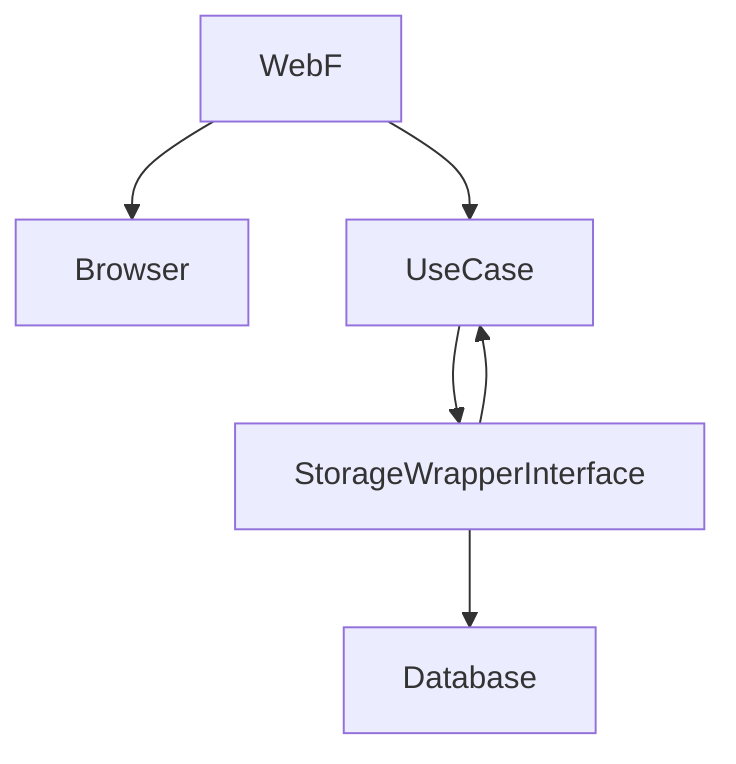

# clean architectures in python 

## chapter 01 A day in the life of a clean system

dependency diagram
"knows about relationship"

introducing a very simple system designed with a clean architecture

### data flow
a web application that provides a room renting system

use request a URL such as /rooms?status=available  via http and we have a web framework running to receive this request

the webframework works in the http protocol domain so when it decodes the request  it should pass relevant information to another component that will process it. We call this domain spefici component a Use Case which are the most important component of the whole clean system as it implements business logic.

The main purpose of a good system is to Separate Concerns
The abstraction of data source, anything an use case can acess data from

How User --> WeBf ? http webframework
how WebF --> use case ? direct url matching call
how use case --> db ? 
	clearly we could hard code into the use case call to a a specific system such as sql but naturally the would be strongly coupled.
	typically we avoid coupled parts of a system. Why we avoid coupling ?
	we avoid coupling to guarantee predicability of the system when we modify one part of the system. In other words we want to guarantee that when we change one part of the code the other is unchanged.
	coupled components by definition are not independent.
	it makes it harder for testing 
	i.e. if we decide to hard code a postgres solution, the use case will be tied to a specific postgres data source
	Usually the use case needs to extract all rooms with a given status so the db wrapper needs to provide a single entry point that we might call list_rooms_with_stats
	Now that the use case knows the wrapper interface it can call the entrypoint name passing the required parameter (the use case dev needs to know the entry point name and required params). The adapter knows the storage system details and acesss and transforms it outputting the format expected by the use case (the adapter developer needs to know the expect data model format from the Use Case)

### how can we avoid strong coupling ?
	1. a simple solution is inversion of control
	inversion of control happens in two phases. first, the called object (the db in this case) is wrapped with a standard interface. this is a set of functionalities shared by every implmentation of the target and each interface translates the functionalities to calls to the spefici language of the wrapped inplementation
	in the second phase of inversion control the caller( the use case) is modified to avoid hard coding the call to the specific implementation, as this would again couple the two. the use case acceps an incoming object as a paramenter of its constructor and receives a concrete instasnce pf the adapter at creation time. the speficic technique used to implement this depends greatly on the programming language we use. In python we dont have an explicit interfacea syntax so we assume the object we pass implements the required methods
### what's inversion of control ?
	it involves creting an interface, that gives the responsability to the interface to convert the specific implementation detail to the format the Use Case expects, for example for thedatabase case we create a Storage Wrapper that can use the Repository pattern
	The analogy of the plug, is that we set a default plug format and anything else different from the expected plug format needs an adapter.

