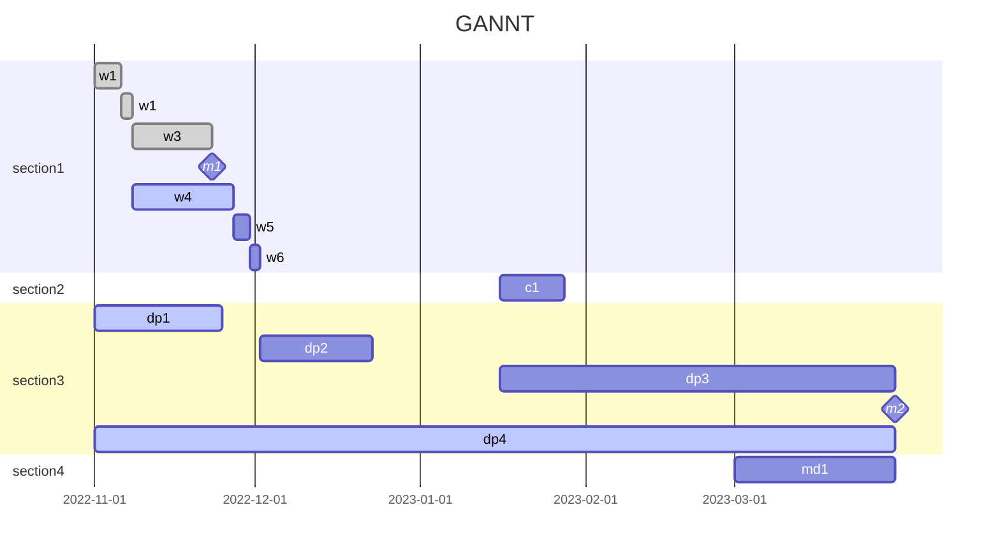
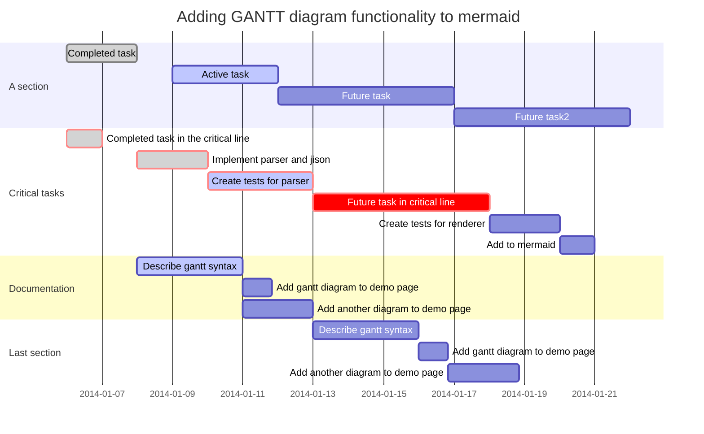

```mermaid
gantt
dateFormat  YYYY-MM-DD
title       GANNT

section section1
w1   :done, w1, 2022-11-01, 2022-11-06
w1   :done, w2, after w1, 2d
w3  :done, w3, after w2, 2022-11-23
m1 :milestone, m1, 2022-11-23 , 0d
w4 :active, w4, after w2, 2022-11-27
w5 :w5, after w4, 3d
w6 :w6, after w5, 2d

section section2
c1   :c1, 2023-01-16, 2023-01-28

section section3
dp1   :active, dp1, 2022-11-01, 2022-11-25
dp2   :dp2, after w6 dp1, 2022-12-23
dp3   :dp3, 2023-01-16, 2023-03-31
m2    :milestone, m2, 2023-03-31, 0d
dp4   :active, dp4, 2022-11-01, 2023-03-31

section section4
md1  :md1, 2023-03-01, 2023-03-31
```

```mermaid
gantt
dateFormat  YYYY-MM-DD
title Adding GANTT diagram functionality to mermaid

section A section
Completed task            :done,    des1, 2014-01-06,2014-01-08
Active task               :active,  des2, 2014-01-09, 3d
Future task               :         des3, after des2, 5d
Future task2               :         des4, after des3, 5d

section Critical tasks
Completed task in the critical line :crit, done, 2014-01-06,24h
Implement parser and jison          :crit, done, after des1, 2d
Create tests for parser             :crit, active, 3d
Future task in critical line        :crit, 5d
Create tests for renderer           :2d
Add to mermaid                      :1d

section Documentation
Describe gantt syntax               :active, a1, after des1, 3d
Add gantt diagram to demo page      :after a1  , 20h
Add another diagram to demo page    :doc1, after a1  , 48h

section Last section
Describe gantt syntax               :after doc1, 3d
Add gantt diagram to demo page      : 20h
Add another diagram to demo page    : 48h
```

